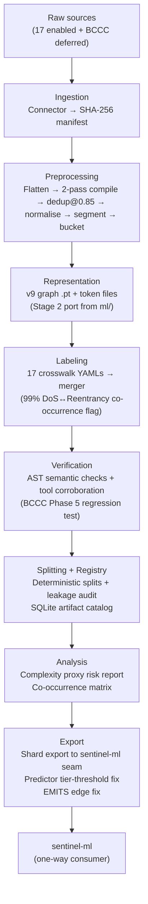

# sentinel-data Architecture

## Data flow



---

## Per-stage contracts

| Stage | Input | Output | Schema | Side effects |
|---|---|---|---|---|
| **ingest** | `config.yaml` enabled sources | `data/raw/<source>/*.sol` + `ingestion_manifest.json` | — | Pin verification; SHA-256 per file |
| **preprocess** | `data/raw/` `.sol` files | `data/preprocessed/<source>/<sha256>.sol` + `.meta.json` | sidecar v1 | Drops compile failures to `dropped.csv`; 3-level dedup |
| **represent** | `data/preprocessed/` `.sol` + `.meta.json` | `data/representations/<sha256>.pt` + `_tokens/` | graph v9 | Uses v9 schema (12 features, 14 node types, 12 edge types) |
| **label** | `data/representations/` graphs + 17 crosswalk YAMLs | `data/labels/multilabel_index.csv` | class order LOCKED | Co-occurrence matrix; 99% DoS↔Reentrancy flag |
| **verify** | `data/labels/` CSV + tool outputs | `data/verification/contracts_clean.csv` + `verification_report.md` | — | Drops labels below `fail_threshold=0.30`; Phase 5 regression test |
| **split** | `data/verification/` clean CSV | `data/splits/train.csv`, `val.csv`, `test.csv` | — | Leakage auditor must return 0 |
| **register** | `data/splits/` CSVs | `data/registry/catalog.sqlite` | — | Versioned artifact entry |
| **analyze** | `data/registry/` + `data/labels/` | `data/analysis/complexity_proxy_risk.md` + `co_occurrence_matrix.csv` | — | L4 finding catcher; co-occurrence flag |
| **export** | `data/registry/` + `data/representations/` | `data/exports/*.shard.tar` | seam v1 | Predictor tier-threshold fix; EMITS edge fix; dual-path seam swap test |

---

## DVC DAG

```
ingest
  └── preprocess
        └── represent
              └── label
                    └── verify
                          └── split
                                └── register
                                      └── analyze
                                            └── export
```

Each stage is a node in `dvc.yaml`. Re-running a stage only re-runs downstream stages (DVC caching). To skip all earlier stages and start from `verify`: `dvc repro verify`.

---

## One-way dependency boundary

```
sentinel-ml (pyproject.toml)
  └── depends on sentinel-data ^0.1.0

sentinel-data (pyproject.toml)
  └── NO dependency on sentinel-ml
```

Enforced at install time. CI gate: `poetry show --tree | grep -i sentinel-ml` in `Data/` returns empty.

---

## Confidence tier system

| Tier | Description | Sources |
|---|---|---|
| T0 | Verified exploit — on-chain proof | DeFi Hacks REKT |
| T1 | Gold — human-curated or mathematically certain | DIVE, FORGE, SolidiFI, SmartBugs Curated, Web3Bugs |
| T2 | Silver — expert auditors or 3/5 tool majority | ScrawlD, Code4rena, EVMbench |
| T3 | Bronze — tool-generated, conservative threshold | SmartBugs Wild, Slither-Audited, OZ |
| T4 | Unlabeled — pretraining / NonVulnerable class only | DISL, ReentrancyStudy |

Tool-agreement is **corroborative, not authoritative**. Human audit (T0/T1) always overrides tool labels (T2/T3). Conkas+Slither+Smartcheck only detects 76.78% of actual vulnerabilities; Slither reentrancy precision is 51.97% (friend's research, Part 1).

---

## The 5 critical tests (structural defense against the BCCC class of failure)

1. **36-issue pre-Run-8 audit regression test** (Stage 2) — every A1–A38 fix is preserved through the port
2. **Byte-identical regression test** (Stage 2) — new path output = old `ml/` path output
3. **BCCC Phase 5 regression test** (Stage 4) — new verification module matches Phase 1–5 results ±0.5%
4. **Dual-path seam swap test** (Stage 7) — old `dual_path_dataset.py` = new `sentinel_dataset.py` byte-identical
5. **7 v2-readiness gates** (Stage 7) — schema + Phase 5 + round-trip + complexity + per-class + leakage + 36-issue

---

## Known open bugs (fix scheduled in Stage 7)

| Bug | Location | Stage 7 action |
|---|---|---|
| EMITS edge bug (Interp-6) | `ml/src/preprocessing/graph_extractor.py` | Fix during seam swap |
| Predictor tier threshold (hardcoded 0.55) | `ml/src/inference/predictor.py:150,168,752` | Fix during seam swap |
| CALL_ENTRY cross-function external calls | `ml/src/preprocessing/graph_extractor.py:1001` | Preserve partial fix; full fix post-Run-11 |
