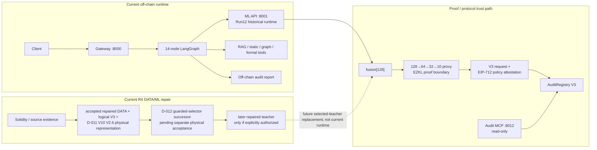

# SENTINEL

**Evidence-aware smart-contract security research and engineering.**

SENTINEL explores how an automated smart-contract audit system can combine machine learning, multi-tool agentic analysis, verifiable inference, and on-chain provenance **without collapsing uncertainty or overstating what the evidence proves**.

The repository is a long-running engineering project spanning Solidity DATA pipelines, graph/code ML, LangGraph orchestration, MCP services, ZKML, and upgradeable smart contracts. It is under active development and is **not presented as a production-ready security product**.

## Why this project exists

A vulnerability classifier is only one part of a trustworthy audit system. Real systems also have to answer harder questions:

- Where did the training/evaluation evidence come from?
- Is an unknown label really a negative example?
- Did equivalent or related contracts leak across dataset roles?
- What happens when an analyzer or external tool did not run?
- Which part of an AI result can a cryptographic proof actually establish?
- Which component is allowed to sign or broadcast an on-chain action?
- Can later reviewers reproduce the exact artifact and decision that a claim came from?

SENTINEL is built around those boundaries rather than hiding them behind a single confidence score.

## What SENTINEL contains

| Area | What is implemented |
|---|---|
| **DATA / evidence** | Solidity ingestion, preprocessing, graph/token representations, versioned evidence semantics, leakage-safe grouping/roles, DVC-backed historical lifecycle, and the current R4 repair path |
| **Machine learning** | A four-eye graph/code teacher architecture, historical Run12 inference, interpretation/evaluation utilities, and Phase-8-compatible repaired-training mechanics |
| **Agentic analysis** | A 14-node LangGraph pipeline combining ML, RAG, static/graph/formal evidence, explicit degraded states, and five MCP services |
| **ZKML** | Distillation of the 128-value teacher fusion representation into a compact 128→64→32→10 proxy plus retained EZKL proof artifacts |
| **Smart contracts** | `SentinelToken`, an EZKL verifier boundary, and an upgradeable `AuditRegistry` with historical V1/V2 compatibility and the current V3 context-attested protocol |
| **Engineering governance** | Versioned ADRs, evidence manifests, physical-lineage binding, fail-closed gates, reproducibility records, and explicit claim/authorization boundaries |

## Architecture at a glance

SENTINEL has separate runtime, DATA/ML-repair, and proof/protocol tracks. They are related, but they are **not one currently connected end-to-end production pipeline**.



Three boundaries are intentionally separate:

1. **Analysis runtime:** gateway + LangGraph currently use the historical Run12 ML service and produce an off-chain report. The accepted R4 V10 physical lineage has not replaced Run12 in live inference.
2. **Proof boundary:** the retained EZKL proof establishes the compact proxy computation only; it does not prove Solidity analysis, teacher execution, LangGraph routing, or the final audit verdict.
3. **Submission authority:** V3 binds audit context/provenance with a separate EIP-712 policy attestation. A production signer/broadcaster is not part of the current analysis service.

The handbook’s [Current architecture](docs/handbook/01_architecture.md) owns the four canonical technical views: whole-system ownership, normal audit request flow, DATA/ML lifecycle, and proof/attestation/on-chain trust path. See also [Runtime flows](docs/handbook/02_runtime_flows.md) and [Security and trust](docs/handbook/12_security_and_trust.md).

## Selected engineering highlights

### 1. Unknown is not negative

A major DATA/ML correction was recognizing that many historical binary `0` cells represented **unknown, unsupported, absent, or dropped evidence**, not trustworthy negatives. The repaired semantic layer therefore carries nullable targets, evidence strength, loss/metric eligibility, and explicit dataset roles instead of manufacturing negative labels.

### 2. Leakage grouping was treated as an evidence problem

A previous grouping approach allowed common Ethereum address literals to connect unrelated contracts into a 10,327-contract component. R4 replaced that authority with defensible artifact/code/family identity rules. The accepted logical V3 population contains **22,394 groups**, maximum group size **7**, and zero address-authority edges.

### 3. Representation defects were fixed before retraining

Full-population investigation showed that historical graph schema v9 did not reliably represent important call semantics. Rather than train on a known-bad representation or weaken the checks, SENTINEL moved to a versioned V10 lineage and independently reconciled every observed structural drift before physical acceptance.

### 4. Tool silence is not a clean result

The AGENTS layer distinguishes `tool did not run`, `tool failed/degraded`, and `tool ran with zero findings`. This prevents unavailable evidence from silently becoming a benign security conclusion.

### 5. ZK proof scope is deliberately narrow

The retained proof verifies only the compact proxy computation. V3 provenance/context authentication is a separate mechanism. The project explicitly refuses the stronger—but unsupported—claim that the circuit proves the source audit or final agent verdict.

The full evidence trail for these decisions lives in the [R4 control plane](docs/plan/ml-R4/00_MASTER_PLAN.md) and [current status ledger](docs/handbook/16_current_status.md).

## Current project status

SENTINEL is active research/engineering work. The concise current boundary is:

| Surface | Current state |
|---|---|
| Historical R4 gates | **G0–G7 PASSED and immutable** |
| Phase 8 / G8 | **IN PROGRESS / open** |
| Current accepted physical representation | exact **V10 V2.6** lineage under R4-D-011 |
| Guarded token selector | R4-D-012 authorizes it only for a **fresh successor candidate** that still requires separate physical acceptance |
| ML runtime | **Run12** remains the historical operational baseline; no repaired R4 teacher has been trained/promoted |
| Confirmed negatives | **0**; candidate review work remains evidence-gated |
| Threshold/calibration/untouched acceptance | currently unsupported/empty for the repaired path |
| Full repaired training | **not authorized** |
| AGENTS chain behavior | default gateway path is off-chain; live audit MCP is **read-only** |
| ZKML assurance | retained proxy-only proof; current bundle still records `check_mode="UNSAFE"` as a production-assurance limitation |
| V3 transaction authority | protocol exists; no production signer/broadcaster is claimed |
| License | no repository license has been selected yet |

For exact counts, digests, candidate-review state, and current execution authority, use [Current status and gap ledger](docs/handbook/16_current_status.md). That file—not this summary—is the canonical explanatory status surface.

## Explore the project

| If you have… | Start here |
|---|---|
| **2 minutes** | this README → [Current status](docs/handbook/16_current_status.md) |
| **10 minutes** | [Architecture](docs/handbook/01_architecture.md) → [Runtime flows](docs/handbook/02_runtime_flows.md) → [Security/trust](docs/handbook/12_security_and_trust.md) |
| **A development task** | [DEVELOPMENT.md](DEVELOPMENT.md) → target module README |
| **A DATA/ML review** | [DATA pipeline](docs/handbook/03_data_pipeline.md) → [DATA artifacts / ML seam](docs/handbook/04_data_artifacts.md) → [R4 control plane](docs/plan/ml-R4/00_MASTER_PLAN.md) |
| **A deep technical audit** | source/tests → current R4 machine-readable evidence/ADRs → handbook → historical records |

## Repository map

| Path | Responsibility |
|---|---|
| [`data_module/`](data_module/) | ingestion, preprocessing, representations, historical lifecycle, DATA vNext/R4 |
| [`ml/`](ml/) | four-eye teacher, historical Run12 runtime, repaired-training mechanics, evaluation/interpretation |
| [`agents/`](agents/) | LangGraph orchestration, RAG/evidence, gateway, five MCP services, security and feedback boundaries |
| [`zkml/`](zkml/) | proxy distillation, ONNX/EZKL proof lifecycle, retained proof artifacts |
| [`contracts/`](contracts/) | staking token, verifier, UUPS AuditRegistry V1/V2/V3 protocol |
| [`docs/handbook/`](docs/handbook/) | canonical current explanatory documentation |
| [`docs/plan/ml-R4/`](docs/plan/ml-R4/) | active DATA/ML evidence, policies, manifests, gates, ADRs and decision history |

## Technology stack

**AI / ML:** Python, PyTorch, PyTorch Geometric, Transformers / GraphCodeBERT, NumPy, scikit-learn

**Agentic / services:** LangGraph, MCP, FastAPI, Pydantic, SQLite, RAG tooling

**Smart-contract analysis:** Solidity, Slither and graph/representation tooling

**ZK / blockchain:** EZKL, ONNX, Solidity, Foundry, OpenZeppelin/UUPS, EIP-712

**Data / engineering:** DVC, Poetry, pytest, GitHub Actions, structured JSON/YAML/CSV evidence artifacts

## Development and validation

SENTINEL is a **multi-environment monorepo**. There is intentionally no fake universal `poetry install` path across ML, DATA, AGENTS, ZKML, and Contracts.

For a lighter history-preserving clone:

```bash
git clone --filter=blob:none https://github.com/motafegh/sentinel-.git
cd sentinel-
```

Then start with the environment contract:

```text
DEVELOPMENT.md
```

A dependency-light documentation/invariant check is:

```bash
export TMPDIR=/tmp TMP=/tmp TEMP=/tmp
python3 docs/handbook/tools/verify_handbook.py static
python3 docs/handbook/tools/verify_handbook.py inventory
python3 -m unittest discover -s docs/handbook/tools/tests -p 'test_*.py'
```

Module-specific setup/test commands, local artifact requirements, GPU/analyzer prerequisites, DVC boundaries, and full-runtime instructions are documented in [DEVELOPMENT.md](DEVELOPMENT.md) and [Operations](docs/handbook/14_operations.md).

Large historical DATA, teacher, RAG, runtime, or proving artifacts are **not** claimed to be available from every fresh clone.

## Engineering approach

SENTINEL is developed with extensive **AI-assisted engineering**. AI assistants are used as implementation, investigation, review, and documentation collaborators; project ownership remains centered on architecture, evidence interpretation, scope/claim decisions, validation, and maintaining the technical provenance of what is accepted or rejected.

That approach is visible in the repository history rather than hidden. The quality bar is therefore not “who typed each line,” but whether a change has a defensible design, inspectable implementation, tests/evidence, and an honest statement of its limitations.

## Documentation authority

For current behavior and claims, use this order:

1. executable source/config/tests;
2. committed machine-readable R4 governance/evidence under `docs/plan/ml-R4/`;
3. canonical handbook under `docs/handbook/`;
4. ADRs/decision/register records;
5. supplementary or historical documents.

Historical plans, reports, and learning artifacts are intentionally retained for auditability but do not override current authority.

## Security

Do not commit `.env` values, private keys, mnemonics, RPC/API credentials, or private artifact endpoints. For a suspected vulnerability or accidental credential exposure, follow [SECURITY.md](SECURITY.md) rather than posting sensitive details in a public issue.