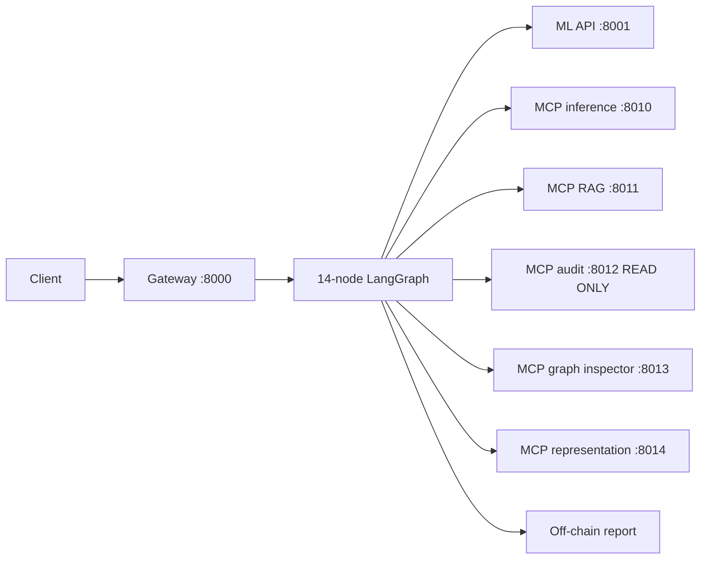
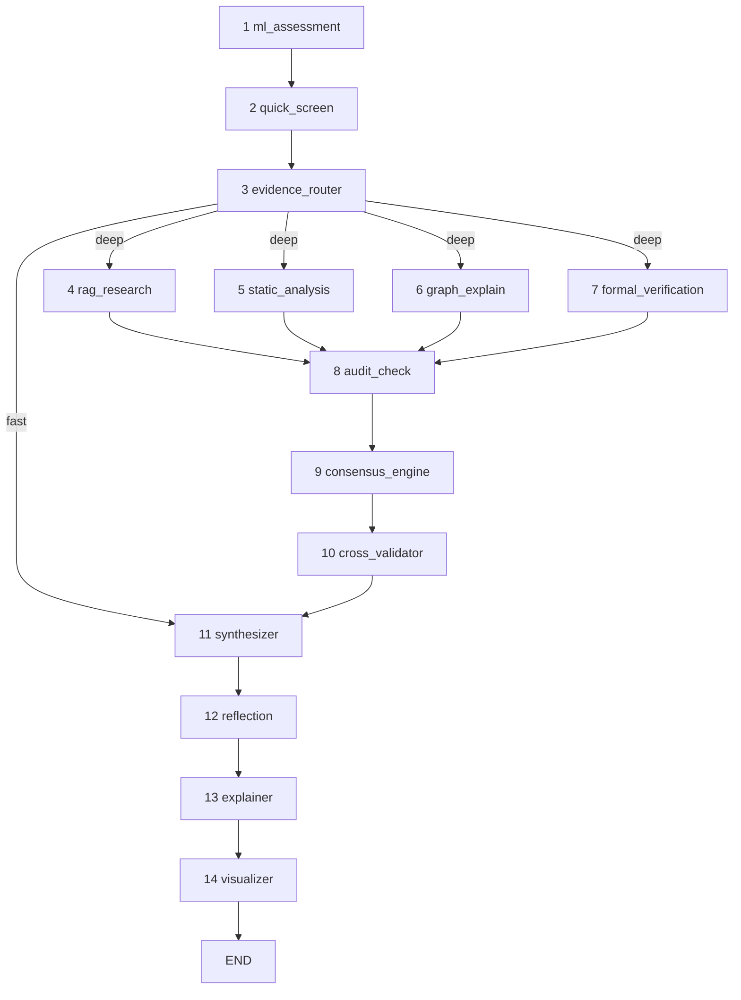
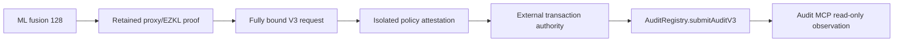
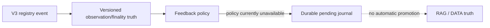

# SENTINEL AGENTS — Current Architecture Diagram

This is the current visual index for `agents/`. For exact status and limitations, see [`../docs/handbook/16_current_status.md`](../docs/handbook/16_current_status.md).

## 1. Off-chain analysis runtime



Gateway completion is not a V3 transaction. The report begins with unsubmitted on-chain state unless an independent external submission system acts later.

## 2. Fourteen-node LangGraph



`audit_check` observes registry history. It does not submit a transaction.

## 3. Live MCP surface

| Port | Service | Current tools |
|---:|---|---|
| 8010 | inference | `predict`, `batch_predict` |
| 8011 | RAG | `search` |
| 8012 | audit | `get_latest_audit`, `get_audit_history`, `check_audit_exists` |
| 8013 | graph inspector | `get_graph_hotspots` |
| 8014 | representation | `get_function_cfgs` |

Audit MCP :8012 is deliberately read-only. Its live server imports `_readonly_handlers.py`.

## 4. V3 protocol is a separate trust domain



The analysis MCP does not hold private keys, sign, construct, or broadcast the V3 transaction.

## 5. Feedback boundary



Historical V1 scalar feedback behavior must not be reused as V3 promotion policy without measured evidence.

## 6. Evidence/trust reminders

- `tool_status.ran=false` is not a clean result.
- learned/tool/RAG/LLM outputs are evidence, not ground truth.
- `verdict_provable` is not the retained EZKL circuit statement.
- Run12 ML evidence remains historical-model evidence until R4 retraining.
- an on-chain V3 record proves protocol/proxy/context checks, not vulnerability ground truth.

## Source map

```text
agents/src/api/                     gateway/job store
agents/src/orchestration/           graph/state/nodes/verdict
agents/src/mcp/servers/             live five-service mesh
agents/src/mcp/servers/audit/       read-only registry observation
agents/src/security/policy_signer.py  V3 request/digest boundary
agents/src/contracts/               V3 submission truth models
agents/src/ingestion/               V3 feedback observation/policy/runtime
agents/src/rag/                     retrieval/index lifecycle
agents/src/eval/                    orchestration/evidence evaluation
```

Canonical detail: [`../docs/handbook/09_agents_orchestration.md`](../docs/handbook/09_agents_orchestration.md), [`../docs/handbook/10_agents_services.md`](../docs/handbook/10_agents_services.md), and [`../docs/handbook/12_security_and_trust.md`](../docs/handbook/12_security_and_trust.md).
