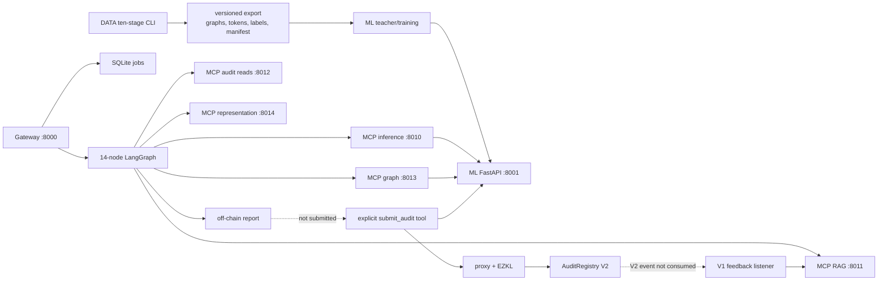

# SENTINEL D2 cross-system architecture and threat-model audit

**Audit date:** 2026-07-14
**Runtime baseline:** `4b5bd333c63ab7a7ec83810fbbae54f3ebf1b493`
**Track status:** `TRACK_REPRODUCED`; integrated into canonical registry, package remains `REVIEW_REQUIRED`
**Scope:** DATA, ML, ZKML, Contracts, AGENTS, services, persistence, deployment, and their interfaces
**Mutation policy:** audit documentation only; no runtime, configuration, test, model, circuit, or chain artifact was changed

## 1. Executive conclusion

SENTINEL is not one end-to-end oracle at this baseline. It is two partially connected systems:

1. a public gateway that runs a 14-node off-chain AGENTS graph and persists a report; and
2. a separately invoked audit-MCP tool that asks ML for a 128-value embedding, proves a 10-output proxy computation, and submits a V2 registry transaction.

The source has useful local integrity controls—content-addressed DATA files, export hash gates, a canonical v9 graph schema, explicit `tool_status`, atomic RAG index writes, a tracked verifier stack, and on-chain proof/public-score consistency. Those controls do not compose into an end-to-end commitment. No current object binds source or deployed bytecode, DATA identity, teacher checkpoint, fusion vector, proxy/circuit/verifier, deterministic AGENTS evidence, operator set, report, and chain record under one typed run identity.

The most serious cross-system risks are:

- public unauthenticated services include a transaction-signing tool backed by a server-held operator key;
- mock/degraded backends can report healthy and can propagate fabricated prediction evidence;
- proof target, model identity, and reported/stored proof hashes are not one semantic commitment;
- gateway jobs are in-process tasks with persistence but no resumable/distributed execution;
- the V2 submission path is invisible to the V1-only feedback listener;
- configuration names and precedence conflict between processes; and
- a fresh clone cannot reproduce DATA→teacher→proof→contract behavior because required artifacts and Foundry libraries are absent.

These findings corroborate the DATA, ML, ZK/contracts, and AGENTS tracks. Track-specific defects should keep their canonical module IDs; this appendix assigns `D2-X-*` only where the failure is genuinely in the composition of modules.

## 2. Baseline and method

The audit branch contains a documentation-only recovery commit above the requested baseline. This command returned no paths, establishing that the audited executable/configuration surfaces are unchanged from `4b5bd333c`:

```bash
git diff 4b5bd333c --name-only -- \
  data_module/sentinel_data ml/src ml/scripts zkml/src agents/src \
  contracts/src contracts/script contracts/foundry.toml \
  agents/pyproject.toml ml/pyproject.toml data_module/pyproject.toml
```

The review used executable `.py`, `.sol`, and `.sh` source as authority. Markdown was not used to infer behavior. The handbook validator was used only as a source-extraction harness and as the starting inventory.

Evidence methods:

- exact Git/runtime delta and tracked/ignored artifact inspection;
- AST-derived local import graph, strongly connected components, and environment-variable inventory;
- source traces through requests, state, persistence, proof generation, transaction submission, and feedback;
- redacted tracked-text secret heuristic; no value was printed;
- current loopback service availability probe; and
- static handbook/inventory verification after writing this appendix.

## 3. Source ownership and disposition

### 3.1 The 429-file universe

The handbook's configured roots contain exactly 429 `.py`, `.sol`, or `.sh` files. The sorted path list has SHA-256:

```text
1cfe1d0ea96d4a31649d809c3c9ca3e9baf9a3fdd99aeab3d2d6d281e0ab6cbd
```

Every file is covered by a declared guide prefix, but prefix coverage is not the same as an individual production disposition. In particular, `ml/scripts` contributes 216 files, including explicitly archived, legacy, smoke-test, research, and fixture content. This audit therefore preserves the 429-file universe while assigning operational disposition by source category.

| Source category | Count | Owner | D2 disposition |
|---|---:|---|---|
| `data_module/sentinel_data` | 78 | DATA | maintained pipeline/runtime; audit DATA stage contracts, writes, and trust gates |
| `ml/src` | 27 | ML | maintained training/inference runtime; audit DATA seam and HTTP/proof consumers |
| `ml/scripts` root | 24 | ML | maintained operator/build entry points; require artifact/config provenance |
| `ml/scripts/audit` | 11 | ML quality | retained audit tooling; evidence-producing, not serving runtime |
| `ml/scripts/eval` | 6 | ML quality | retained evaluation tooling; evidence-producing, not serving runtime |
| `ml/scripts/interpretability` | 44 | ML research | retained scientific experiments; results require run/artifact binding |
| `ml/scripts/smoke` | 17 | ML test | test/support disposition; not production runtime |
| `ml/scripts/util` | 2 | ML | retained support utilities |
| `ml/scripts/archive` | 85 | ML archive | retired/historical; exclude from production dependency and deployment claims |
| `ml/scripts/_legacy_data_pipeline` | 7 | ML archive | superseded by DATA; exclude from production execution |
| `ml/scripts/test_contracts` | 20 | ML test | Solidity fixtures; exclude from production source count |
| `zkml/src` | 11 | ZKML | maintained distillation/export/proof tooling; operator execution surface |
| `agents/src` | 92 | AGENTS | maintained orchestration/services/security/eval runtime |
| `contracts/src` | 4 | Contracts | deployed protocol/verifier source |
| `contracts/script` | 1 | Contracts operations | deployment tool; secrets must remain environment-only |
| **Total** | **429** | SYSTEM | full D1 inventory universe, with explicit D2 operational classification |

Submodule counts are reproducible with:

```text
DATA: root=2, analysis=7, export=7, ingestion=12, labeling=8,
      preprocessing=10, registry=4, representation=11, splitting=5,
      verification=12
ML runtime: root=1, data_extraction=2, datasets=3, inference=6,
            models=5, preprocessing=3, training=5, utils=2
ZKML: root=1, distillation=6, ezkl=4
AGENTS: api=5, config=3, eval=8, ingestion=6, llm=1, mcp=14,
        orchestration=32, rag=18, security=5
Contracts: src=4, script=1
```

### 3.2 Import graph and responsibility direction

A read-only AST pass parsed 381 Python modules, resolved 502 local import edges, and found these cross-owner edges:

| Direction | Edges | Meaning |
|---|---:|---|
| DATA → ML | 2 | DATA tokenizer and optional CFG code import ML-owned implementations/constants |
| ML → DATA | 5 | ML dataset/schema/extractor shims consume the canonical DATA representation seam |
| ZKML → ML | 8 | distillation and proof tooling consume teacher model, dataset, and predictor |
| AGENTS → ZKML | 1 | audit submission loads the proxy implementation in-process |
| Contracts ↔ AGENTS | protocol | ABI/RPC boundary rather than Python import |

The intended ownership direction is mostly visible, but DATA's imports of `ml.src.data_extraction.windowed_tokenizer` and `ml.src.preprocessing.graph_schema` form a back-edge. DATA cannot be independently packaged for representation without ML being importable, despite DATA being the declared upstream owner.

Four AST strongly connected components were reported. Two are real multi-file cycles:

- `sentinel_data.representation.cfg_builder ↔ sentinel_data.representation.orchestrator`, broken at runtime through local imports; and
- the audit-MCP compatibility/state-holder cycle across `_handlers`, `_lifecycle`, `_server`, and `audit_server`.

The other two are `__init__` self-resolution artifacts. The audit-MCP cycle is deliberately used so tests can monkeypatch shim module state; it is an accepted compatibility mechanism at this baseline, but it makes import identity and order part of runtime correctness.

Active AGENTS and ZKML modules also insert calculated parents into `sys.path`. ML scripts do the same. This allows `src.*`, `ml.src.*`, and `zkml.src.*` identities to coexist, but ties imports to repository layout and invocation style instead of installed package interfaces.

## 4. Current executable architecture



### 4.1 Processes, ports, routes, and tools

| Process | Port | Source-owned public surface | Persistent state / key boundary |
|---|---:|---|---|
| Gateway | 8000 | `GET /`, `GET /health`, `POST /audit`, `GET /audit/{job_id}`, `GET /audit` | jobs SQLite; raw source/report; no authentication |
| ML FastAPI | 8001 | `GET /health`, `POST /predict`, `POST /hotspots`, `POST /fusion-embedding`, `/metrics` | teacher checkpoint, thresholds, drift baseline/buffer, GPU; no authentication in source |
| inference MCP | 8010 | `predict`, `batch_predict`; SSE/messages/health | forwards to ML or returns mock |
| RAG MCP | 8011 | `search`; SSE/messages/health | FAISS, BM25, chunk pickle, metadata |
| audit MCP | 8012 | `get_latest_audit`, `get_audit_history`, `check_audit_exists`, `submit_audit` | RPC, ABI, operator private key, proof workspace; no authentication |
| graph MCP | 8013 | `get_graph_hotspots`; SSE/messages/health | ML/Slither/mock fallback |
| representation MCP | 8014 | `get_function_cfgs`; SSE/messages/health | DATA/Slither/mock extraction |
| feedback listener | no port | polls chain V1 event | block cursor, report bridge, RAG index writes |
| Anvil/Sepolia RPC | 8545/local or configured URL | JSON-RPC | chain accounts, registry/proxy/verifier/token state |

Gateway and all MCP processes default to or explicitly bind `0.0.0.0`. No bearer-token, API-key, mTLS, session, tenant, authorization middleware, or rate limiter was found in these source surfaces. Network isolation is therefore an undocumented external prerequisite, not an application control.

### 4.2 Off-chain gateway flow

`agents/src/api/gateway.py::submit_audit` validates a maximum 200,000-character request, creates a UUID job, and schedules `_run_job` with `asyncio.create_task`. `_run_job` invokes the graph and persists a reduced report. It does not call `submit_audit` on the audit MCP.

The graph executes:

```text
ml_assessment → quick_screen → evidence_router
  fast: synthesizer
  deep fan-out: rag_research/static_analysis/graph_explain/formal_verification
    → audit_check → consensus_engine → cross_validator → synthesizer
synthesizer → reflection → explainer → visualizer
```

The returned report contains a deliberately unsubmitted `on_chain` placeholder. Gateway storage further reduces graph state and does not preserve all evidence/status fields, which is covered by the AGENTS track.

### 4.3 Explicit proof/submission flow

`agents/src/mcp/servers/audit/_submit.py::_run_submit` performs:

1. unauthenticated HTTP `POST /fusion-embedding` to ML;
2. local proxy inference for display scores;
3. EZKL witness/proof/verification using the ML embedding;
4. replacement of display felts with proof instances `[128:138]`;
5. optional off-chain provenance manifest;
6. `AuditRegistry.submitAuditV2` signed by the server operator key.

This is a separate call path. Gateway completion neither requests nor schedules it.

### 4.4 Feedback flow

`agents/src/ingestion/feedback_loop.py::OnChainListener` polls only `AuditSubmitted` V1 events and transforms a single scalar score into a RAG document. Current `_run_submit` emits `AuditSubmittedV2`, so active V2 submissions are not ingested. The listener also persists its block cursor before embedding/index ingestion succeeds; a later lock or write failure loses the event from future polls.

## 5. Cross-module shapes, schemas, and hashes

| Boundary | Executable shape | Identity/integrity behavior | Gap |
|---|---|---|---|
| source → DATA | Solidity bytes + acquisition metadata | SHA-256 file/content records | source URI/revision trust is connector-specific |
| DATA representation | graph `x[N,12]`, `edge_index[2,E]`, edge type; tokens `[4,512]`; labels `[10]` | v9 schema plus content IDs and cache versions | DATA tokenizer still imports ML implementation |
| DATA export → ML | metadata/labels Parquet, graph/token shards, indexes, split membership | manifest `artifact_hash`; loader checks format/schema/hash | export/split missing in fresh clone |
| teacher inference | 10 probabilities, thresholds/tiers, graph counts/hotspots, `model_hash` | checkpoint SHA-256 at predictor startup | raw response schemas duplicated as dicts across MCP/state/report |
| teacher → proxy | fusion embedding `[128]` | runtime returns teacher hash | embedding is not signed or bound to source/target |
| proxy → EZKL | MLP `128→64→32→10`; 10,666 parameters | circuit version string `v2.0`; tracked PT/ONNX/compiled/settings/VK | no promotion manifest binds artifact hashes and measurements |
| EZKL public signals | `[128 inputs + 10 outputs] = 138` field elements | verifier checks proof; registry checks output positions `[128:138]` | target address, model hash, source hash, round, and operator set are absent |
| registry V2 | address + `uint256[10]` + proof + signals + `bytes32 modelHash` | stores `keccak256(proof)`, caller-supplied model hash, submitting address | model hash is not part of proof; single submission is final |
| AGENTS report | `AuditState` → dynamic final report | deterministic/full verdict split and tool status exist in graph | no versioned report schema or canonical report commitment |
| report → feedback | local `{contract_address}.json` lookup | mutable filesystem join by address | not bound to transaction/proof/model/run; V2 event unsupported |

### 5.1 Schema ownership

DATA's `graph_schema.py` is the canonical graph schema and ML re-exports it. Cross-system constants remain copied elsewhere:

- ML trainer declares its own class order;
- ZKML proof code declares its own `NUM_CLASSES` and class list;
- calldata code declares its own input/output offsets;
- Solidity declares fixed `NUM_CLASSES=10`, `INPUT_OFFSET=128`, and comments the class order; and
- AGENTS uses class names in routing/config/evidence dictionaries.

There is no generated, versioned schema package or compatibility matrix consumed by Python, ONNX/EZKL, Solidity, and reports. Existing tests catch some mismatches, but artifact promotion does not atomically bind them.

### 5.2 Hash semantics

The word “hash” names different functions and objects:

- DATA predominantly uses SHA-256 content and export hashes;
- older ML caches use MD5 content keys plus schema suffix;
- teacher/proxy artifacts use SHA-256;
- `_run_submit` reports SHA-256 of raw proof bytes;
- `AuditRegistry` stores `keccak256(proof)`; and
- the transaction sends the original caller `model_hash` even after the ML response has replaced the result's reported `model_hash`.

These are not interchangeable. A typed commitment must include algorithm, domain, canonical encoding, object kind, and version.

## 6. Configuration and deployment topology

An AST inventory found 7 ML and 52 AGENTS environment variables. Configuration precedence is not uniform:

| Process | Precedence/behavior |
|---|---|
| ML | `SENTINEL_CONFIG` JSON path; environment overrides JSON; values captured at import except deterministic startup check |
| AGENTS verdict policy | `SENTINEL_CONFIG` YAML path; cached Pydantic singleton |
| Gateway | `agents/.env` loaded with `override=True`; many constants captured at import |
| audit MCP | dotenv loaded with `override=True`; RPC/address/key/mock state captured at import |
| LLM client / feedback | dotenv loaded without override; values captured at import |
| DATA | YAML/CLI/path configuration, stage-specific defaults |
| Contracts | Foundry environment interpolation and deploy-script environment reads |

`SENTINEL_CONFIG` is therefore a cross-process namespace collision: ML expects JSON while AGENTS expects YAML. Feedback also uses `SEPOLIA_RPC` and `AUDIT_REGISTRY`, whereas audit MCP uses `SEPOLIA_RPC_URL` and `AUDIT_REGISTRY_ADDRESS`. Graph MCP defaults `SENTINEL_ML_API_URL` to 8000 while audit MCP defaults it to 8001.

Deployment assets cover DATA and ML containers and a contracts test workflow. No tracked composition deploys gateway, five MCP services, feedback, key management, chain dependencies, health policy, or startup ordering as one release. Gateway explicitly runs one Uvicorn worker because its task model is process-local.

## 7. State, concurrency, recovery, and idempotency

### 7.1 Persistent and mutable state

| Owner | State |
|---|---|
| DATA | raw/preprocessed source, manifests, labels, representations, tool caches, split files, export shards/indexes/hash cache, catalog SQLite/YAML |
| ML | checkpoint/threshold/config, preprocessing cache, drift baseline/buffer JSONL, MLflow SQLite/artifacts, training logs/checkpoints |
| ZKML | proxy PT/ONNX, calibration, compiled circuit, settings, PK/VK/SRS, proof input/witness/proof scratch |
| AGENTS | jobs SQLite, optional graph checkpoint SQLite, reports/hotspot HTML, RAG files/locks, feedback cursor, eval/reliability output |
| Contracts | proxy implementation/storage, verifier/token addresses, stake balances, V1/V2 audit arrays, events |

Mutable process globals include ML predictor/drift/request count, AGENTS cached configuration, lazy graph singleton/checkpointer connection, MCP backend/mock/Web3 state, model/tokenizer caches, and file-backed RAG/index state.

### 7.2 Concurrency controls that exist

- DATA parallel preprocessing uses content-derived filenames and multiprocessing, while documenting that cross-source duplicate work can still occur.
- RAG full-index and feedback writes use a shared `FileLock` plus temporary-file replacement.
- SQLite stores use process-local threading locks and conditional state updates.
- LangGraph deep evidence branches fan out and merge through state reducers.
- ML processes requests asynchronously but model execution is one process/GPU state.

### 7.3 Missing system controls

- Gateway has no admission semaphore despite a documented `503` response; every valid request creates a task and stores full source.
- Repeated identical gateway requests create independent UUID jobs; there is no idempotency key or content-addressed job identity.
- Public gateway uses `build_graph(use_checkpointer=False)`, so graph checkpoint recovery is disabled even if SQLite support is installed.
- Startup changes interrupted RUNNING jobs to FAILED; no lease, heartbeat, worker owner, retry budget, resumable stage, dead-letter state, or distributed scheduler exists.
- Proof generation uses shared fixed `proof_input.json`, `witness.json`, and `proof.json`; concurrent submissions can overwrite or delete each other's workspace.
- Transaction nonce selection is uncoordinated `get_transaction_count(address)`; concurrent submissions can collide.
- Registry appends duplicate audits and has no round/idempotency/replay key.
- Feedback marks blocks consumed before event ingestion succeeds.

## 8. Error taxonomy, health, and monitoring

Current error contracts vary by boundary:

| Boundary | Error form |
|---|---|
| DATA CLI/build | exceptions, result dataclasses, dropped/error reports, and some stage-specific empty/default behavior |
| ML HTTP | startup failure, Pydantic/HTTP errors, timeout/500 responses |
| MCP | JSON text content containing `error`, fallback payload, or tool-specific `status/failed_step/reason` |
| LangGraph | merged `tool_status` plus a single optional top-level `error`; fail-soft nodes continue |
| Gateway | HTTP validation/not-found plus persisted FAILED background job |
| Contracts | revert strings and transaction failure |

There is no cross-system error envelope or stable error code taxonomy. HTTP success can contain MCP failure or mock evidence. MCP health routes report `status=ok` in mock mode, and gateway service probes treat any HTTP status below 500 as healthy without requiring a live backend. The inference MCP automatically substitutes a mock prediction after ML timeout/unreachability; downstream sees a completed tool call unless it explicitly interprets provenance.

ML exposes Prometheus request metrics and model/GPU/drift signals. Gateway exposes job counts and cached service health. AGENTS/MCP/ZK/feedback lack unified queue depth, job stage, retries, proof duration, nonce, transaction, event lag, mock/degraded, and evidence-provenance metrics. No trace/run ID follows a request through ML, proof, transaction, and feedback.

At `2026-07-14T14:22:46+03:30`, loopback probes to 8000, 8001, 8010–8014, and 8545 all returned connection refusal and no matching listeners were present. This is recorded as unavailable, not skipped or passing.

## 9. Scientific and proof-semantics assessment

### 9.1 Evidence that exists in source

- DATA has exact/near-duplicate controls, independent leakage reporting, label/tool/negative checks, source lineage, and export hash verification.
- ML implements per-class thresholds, calibration/drift/behavioral metrics, AUC/Brier/ECE logging, and checkpoint metadata validation.
- ZKML distillation measures thresholded teacher/proxy agreement and verifies PT→ONNX numerical output before circuit setup.
- AGENTS separates `verdict_provable` from `verdict_full` and records tool status/provenance fields.

### 9.2 What cannot be claimed from this baseline

The fresh clone lacks the DATA export/split and teacher checkpoint. It therefore cannot reproduce current leakage, calibration, held-out/OOD quality, deterministic teacher outputs, or teacher/proxy agreement. Tracked run reports are evidence inputs, not a cryptographic promotion record for the currently tracked proxy/circuit/verifier.

Aggregate bit agreement can be inflated by class imbalance and predictions far from threshold. A decision-grade proxy evaluation needs per-class agreement, false-positive/false-negative disagreement, score error/calibration, boundary cases, and an immutable held-out identity.

EZKL proves only the fixed proxy mapping over the supplied 128 public inputs to 10 public outputs. It does **not** prove:

- which Solidity source or deployed bytecode was analyzed;
- that DATA preprocessing or the teacher produced the embedding;
- that the claimed teacher/model hash was used;
- AGENTS routing, deterministic evidence fusion, thresholds, or report;
- RAG/LLM narrative truth; or
- operator independence or quorum.

The V2 registry checks stake, proof validity, and equality of the ten supplied scores to public outputs. A valid proof is not proof of the full SENTINEL audit claim.

## 10. Threat model

| Threat actor/event | Current control | Residual exposure |
|---|---|---|
| malicious Solidity input | size caps, temp directories in some tools, prompt sanitization, compiler/analyzer isolation patterns | unauthenticated resource exhaustion; track-level path traversal/ZIP issues; analyzer/compiler attack surface |
| prompt-injection source/report | comment/string/role/extraction/etc. detection and delimiting | RAG corpus and feedback trust remain weak; LLM output is nondeterministic advisory evidence |
| unauthenticated remote caller | external network isolation only | gateway writes jobs/reports and consumes tools; audit MCP can spend operator gas and create records |
| malicious/compromised operator | stake threshold and owner slashing | one operator finalizes; immediate unstake; no active-set snapshot, quorum, equivocation proof, or objective slashing |
| replay/cross-target proof | proof verification and public-score equality | contract/model/run/round not proof-bound; same valid proof can be associated with another target |
| model/proxy substitution | reported hashes and optional signed manifest | caller model hash is not proof-bound; manifest is not contract-enforced; no artifact registry |
| key compromise | key from environment, never intentionally logged by reviewed path | long-lived server key in unauthenticated service; no signer isolation, policy engine, rotation protocol, or nonce manager |
| malicious owner/governance | `onlyOwner`, pause, UUPS authorization, owner-only slash | one key controls upgrade/pause/slash; no multisig/timelock/guardian limits |
| colluding operators | not applicable to single-operator V2 | no independent quorum; economic stake does not establish correctness diversity |
| service/GPU/RPC outage | timeouts, structured status in some paths, health loops, mock modes | mock can look healthy; jobs are not resumable; unavailable proof artifacts block finality |
| crash/concurrency | jobs SQLite, RAG locks, DATA content paths | proof/nonce races, process-local task ownership, lost feedback events |
| poisoned feedback/RAG | dedup, score threshold, file lock | V1/V2 mismatch; local report join; overclaims proof semantics; self-generated evidence can reinforce errors |
| upgrade/schema drift | schema constants/tests and UUPS compatibility discipline | no typed cross-language manifest, verifier registry, or atomic migration/cutover protocol |

## 11. Provisional cross-system findings

All IDs are provisional until the unified registry deduplicates track findings. `track-reproduced` means this appendix traced the behavior in source; it is not primary independent reproduction.

### D2-X-001 — P0 — Unauthenticated public control plane can use server-held signing authority

- **Classification/status:** security/trust-boundary; `track-reproduced`.
- **Sources:** `agents/src/api/gateway.py::create_app`; `agents/src/mcp/servers/audit/_server.py::run_server`; `agents/src/mcp/servers/audit/_handlers.py::_handle_submit_audit`; `agents/src/mcp/servers/audit/_submit.py::_run_submit`; `ml/src/inference/api.py::app`.
- **Invariant:** only authenticated, authorized, rate-limited principals may trigger writes, expensive analysis/proof work, or transactions signed by protocol keys.
- **Evidence:** no application authentication/authorization/rate-limit source was found; gateway/MCP bind all interfaces; `submit_audit` signs with `SENTINEL_OPERATOR_KEY`.
- **Impact:** remote gas/stake abuse, arbitrary registry submissions for caller-selected addresses, unbounded compute/storage consumption, and exploitation of downstream filesystem findings.
- **Recommendation:** default-bind loopback; terminate behind authenticated mTLS/OIDC gateway; require per-tool authorization and quotas; isolate signer behind a policy service that validates typed commitments; never expose raw private key to the MCP process.
- **Required tests:** unauthenticated 401/403 on every non-health route; read/write scopes; tenant/job quotas; signer rejects target/model/round mismatch; SSRF/body-size/rate tests.
- **Duplicate note:** report-path traversal is canonical in AGENTS; this finding is the broader cross-service authorization failure.

### D2-X-002 — P1 — Gateway report and chain finality are disconnected products

- **Classification/status:** architectural correctness; `track-reproduced`.
- **Sources:** `agents/src/api/gateway.py::_run_job`; `agents/src/orchestration/nodes/synthesizer.py::synthesizer`; `agents/src/mcp/servers/audit/_submit.py::_run_submit`.
- **Invariant:** a user-visible “completed audit” must state whether it is advisory only or final and must provide one traceable transition to finality.
- **Evidence:** `_run_job` never invokes `_run_submit`; report `on_chain.submitted` remains false; submit is a separate MCP call with separately supplied source/address/model hash.
- **Impact:** clients can mistake an off-chain report for oracle finality; separately repeated inputs can diverge; no atomic report→proof→transaction state exists.
- **Recommendation:** define typed job/round state with explicit `ADVISORY_COMPLETE`, `PROOF_PENDING`, `QUORUM_PENDING`, `FINALIZED`, and terminal failure states; content-address every stage and expose one API without implying automatic finality.
- **Required tests:** state-transition table; report/commitment equality; retries/idempotency; advisory-only response contract; failed proof/transaction recovery.

### D2-X-003 — P1 — Configuration namespace and precedence can cross-wire services

- **Classification/status:** operational correctness; `track-reproduced`.
- **Sources:** `ml/src/inference/api.py::_load_mlops_config`; `agents/src/config/loader.py::_resolve_config_path`; `agents/src/api/gateway.py`; `agents/src/mcp/servers/audit/_config.py`; `agents/src/ingestion/feedback_loop.py`.
- **Invariant:** every process must have a unique typed configuration schema with deterministic precedence and a startup digest.
- **Evidence:** `SENTINEL_CONFIG` means JSON to ML and YAML to AGENTS; dotenv override policy differs; feedback/audit use different RPC/address names; graph/audit disagree on ML URL default.
- **Impact:** startup parse errors, silent wrong endpoints/policies, mock/live confusion, and irreproducible operator behavior.
- **Recommendation:** use service-prefixed config names, one explicit precedence rule (`CLI > env > versioned file > defaults`), forbid dotenv override in production, validate cross-service endpoint contracts, and emit a redacted config digest.
- **Required tests:** shared-environment startup; wrong-schema rejection; precedence matrix; endpoint/port contract; secret redaction.

### D2-X-004 — P1 — Job persistence does not provide recoverable or distributed execution

- **Classification/status:** availability/scalability; `track-reproduced`.
- **Sources:** `agents/src/api/gateway.py::submit_audit`; `agents/src/api/gateway.py::_run_job`; `agents/src/api/sqlite_job_store.py::recover_pending`; `agents/src/orchestration/graph.py::build_graph`.
- **Invariant:** an accepted audit must have durable ownership, lease/heartbeat, idempotent stages, retry policy, and crash recovery.
- **Evidence:** process-local `create_task`; public path disables graph checkpointer; startup marks running jobs failed; no lease, heartbeat, retry queue, worker owner, or admission semaphore.
- **Impact:** accepted work is lost on crash; horizontal scaling is unsafe; duplicate requests repeat expensive analysis; queue overload is unbounded.
- **Recommendation:** content-addressed job ID plus request idempotency key; durable queue; atomic claim/lease/heartbeat; per-stage attempts and outputs; dead-letter/requeue policy; bounded admission and cancellation.
- **Required tests:** kill at every stage; expired lease reclaim; duplicate request; two workers; timeout/cancel; artifact already committed; poison job isolation.

### D2-X-005 — P1 — Audit identity and hash semantics split across report, proof, and chain

- **Classification/status:** integrity/auditability; `track-reproduced`.
- **Sources:** `agents/src/mcp/servers/audit/_submit.py::_run_submit`; `contracts/src/AuditRegistry.sol::submitAuditV2`; `agents/src/orchestration/nodes/synthesizer.py::synthesizer`.
- **Invariant:** one canonical typed commitment must bind target, source/bytecode, artifacts, outputs, report, operator/round, and hash algorithms.
- **Evidence:** ML hash replaces the reported result but original caller hash is sent on-chain; off-chain reports SHA-256 proof hash while registry stores Keccak; no report/proof commitment joins the two flows.
- **Impact:** evidence cannot be reconciled reliably; on-chain metadata can claim a different teacher; incident response cannot prove which object a hash names.
- **Recommendation:** domain-separated canonical encodings and typed hash fields; reject caller/ML model mismatch; commit source/bytecode, execution manifest, deterministic evidence root, proxy/circuit/verifier, proof, and report.
- **Required tests:** shared Python/Solidity vectors; algorithm/domain mismatch; caller/ML mismatch; canonical JSON/CBOR encoding; report/proof/chain reconciliation.
- **Duplicate note:** cross-target proof replay is canonical in ZK/contracts; this finding addresses the larger identity chain.

### D2-X-006 — P1 — V2 chain results are lost or misrepresented by feedback ingestion

- **Classification/status:** correctness/scientific feedback; `track-reproduced`.
- **Sources:** `contracts/src/AuditRegistry.sol::AuditSubmittedV2`; `agents/src/ingestion/feedback_loop.py::AUDIT_REGISTRY_ABI`; `OnChainListener.get_new_events`; `FeedbackIngester.process_event`.
- **Invariant:** every finalized supported event version must be ingested exactly once with transaction-bound evidence and accurate proof semantics.
- **Evidence:** listener ABI/get-logs supports only V1 while active submit emits V2; block cursor advances before ingestion; vulnerability type comes from mutable address-keyed local report; content says the full model computation is guaranteed.
- **Impact:** V2 findings never reach RAG; transient write failures permanently drop events; wrong reports can poison feedback; downstream users receive a false scientific claim.
- **Recommendation:** versioned V1/V2 decoders; durable event inbox keyed by `(chainId, txHash, logIndex)`; advance checkpoint only after inbox commit; bind report CID/root from the finalized round; describe proxy-only proof truthfully; require review before training/trust escalation.
- **Required tests:** V2 event decode; reorg; duplicate log; partial batch; lock failure/retry; missing/mismatched report; score vector/class mapping; proof-semantics text assertion.

### D2-X-007 — P1 — Fresh clone cannot reproduce the system evidence chain

- **Classification/status:** reproducibility/deployment; `track-reproduced`.
- **Sources:** tracked/ignored artifact state; root/ML/DATA/AGENTS dependency manifests; `contracts/foundry.toml`.
- **Invariant:** a release must resolve dependencies and acquire immutable artifacts with verified hashes before tests or operation.
- **Evidence:** missing teacher checkpoint, DATA export/split, proving key, SRS, Foundry libraries, and V2 test; no Foundry submodule registration; overlapping environments have conflicting dependency constraints; ZKML has no independent locked environment.
- **Impact:** core quality/proof/contract claims cannot be reproduced; operators can build different stacks; “passing” coverage depends on private local state.
- **Recommendation:** release manifest with immutable artifact URIs/hashes/licenses; bootstrap verifier; lock one supported environment per process; register Foundry dependencies; fresh-clone CI that distinguishes public, private, live, and unavailable evidence.
- **Required tests:** clean clone/bootstrap; offline hash check; absent artifact failure; wrong artifact rejection; Foundry build/test; DATA→ML seam; proof prerequisite preflight.

### D2-X-008 — P1 — Cross-language schema and artifact promotion are not atomic

- **Classification/status:** compatibility/integrity; `track-reproduced`.
- **Sources:** DATA `graph_schema.py`; ML `trainer.py`; ZKML `proxy_model.py`/`run_proof.py`; `AuditRegistry.sol`; AGENTS routing/state/config.
- **Invariant:** class order, dimensions, encodings, circuit/version, and report schema must be generated from and promoted with one versioned interface.
- **Evidence:** canonical DATA schema exists, but class/dimension constants are copied across Python/Solidity; no tracked promotion record binds DATA, teacher, thresholds, proxy, ONNX, settings, VK, verifier bytecode, and deployment.
- **Impact:** individually valid components can disagree silently; old reports/contracts cannot be interpreted safely after evolution.
- **Recommendation:** versioned system manifest plus generated Python/Solidity constants; verifier registry keyed by circuit/signal-layout IDs; compatibility adapters for V1/V2; promotion gate verifies all artifact hashes and scientific metrics.
- **Required tests:** generated-code drift; class reorder; dimension mismatch; old/new record decoding; verifier registry lookup; artifact DAG hash reconciliation.

### D2-X-009 — P0 — Mock/degraded state can propagate as successful deterministic evidence

- **Classification/status:** correctness/trust; `merged-duplicate` into canonical `D2-AGT-001`.
- **Sources:** `agents/src/mcp/servers/inference_server.py::_call_module1`; MCP health routes; `agents/src/api/gateway.py::_probe_services`; `agents/src/orchestration/nodes/ml_assessment.py::ml_assessment`.
- **Invariant:** unavailable live evidence must never become a successful evidence item or healthy dependency.
- **Evidence:** inference MCP falls back to mock on ML failure; its health remains HTTP 200/`ok`; gateway checks HTTP status, and downstream call success can set `tool_status.ml.ran=True`.
- **Impact:** outages fabricate plausible evidence and contaminate reports/evaluation/proofs.
- **Recommendation:** mocks only behind explicit test transport; health states `live/degraded/mock/unavailable`; provenance mandatory in tool result; graph rejects mock for production/deterministic/finality modes.
- **Required tests:** ML timeout/unreachable; mock-enabled production rejection; health semantic propagation; no evidence emission; report/finality gate.

### D2-X-010 — P2 — End-to-end observability cannot reconcile a run

- **Classification/status:** operational debt; `track-reproduced`.
- **Sources:** ML Prometheus instrumentation; gateway health/job store; AGENTS timing/logging; proof/feedback code.
- **Invariant:** one run identity must correlate request, stages, artifacts, proof, transaction, and feedback with measurable SLOs.
- **Evidence:** no shared trace/run/round ID, proof/job metrics, transaction/event lag, mock/degraded counters, or alert integration spans processes.
- **Impact:** incidents and performance regressions require manual log/artifact joins; stale or lost work is hard to detect.
- **Recommendation:** propagate audit/run/round IDs; structured logs; OpenTelemetry spans; queue/stage/tool/proof/tx/event metrics; mock/degraded and artifact-version labels; alerts with bounded cardinality.
- **Required tests:** trace propagation; metric labels; error/cancel/retry spans; proof/tx reconciliation; event-lag alert.

### D2-X-011 — P2 — “429 active production files” conflates runtime, tests, research, fixtures, and archives

- **Classification/status:** inventory/governance debt; `track-reproduced`.
- **Sources:** `docs/handbook/_meta/handbook.toml::coverage.production_roots`; validator recursive file enumeration; source directory names.
- **Invariant:** architecture coverage must distinguish deployed runtime, build tooling, quality tooling, research, fixtures, and retired source.
- **Evidence:** recursive `ml/scripts` contributes 85 archive files, 7 legacy pipeline files, 17 smoke files, and 20 Solidity fixtures to the “active production” count.
- **Impact:** ownership coverage passes while deployable attack surface and maintenance obligations remain ambiguous.
- **Recommendation:** replace one count with classified manifests and explicit include/exclude rules; keep archived source reviewable but outside production readiness claims.
- **Required tests:** inventory category totals; no unclassified file; deploy image contents subset runtime manifest; archive cannot be imported by production entry points.

## 12. V3 implications

The source evidence supports the planned V3 direction and fixes several required decisions:

- define a typed `AuditIdentity` and `ExecutionManifest`, not free-form hashes;
- commit deployed chain/address/code hash and source artifact separately;
- bind teacher, DATA schema/export, proxy, ONNX, circuit/settings/VK, verifier, class layout, thresholds/policy, deterministic evidence root, and advisory report root;
- make proof workspace and transaction nonce ownership per job/operator;
- use durable jobs with leases/heartbeats/retries and idempotent artifacts;
- make `ceil(2N/3)` quorum attest one immutable active-set snapshot and commitment;
- retain the truth boundary: EZKL proves proxy computation only; quorum attests execution/identity; LLM/RAG stays advisory;
- store compact finality on-chain and content-address detailed evidence off-chain;
- support V1/V2 reads and event ingestion during migration; and
- put signer, operator admission, upgrades, pause, slashing, unbonding, and rollback behind explicit state machines and governance delays.

## 13. Evidence command ledger

Commands below are non-mutating except for temporary files under `/tmp` and ordinary interpreter/test caches.

```bash
# Baseline and runtime delta
git rev-parse HEAD
git show -s --format='%H %s' 4b5bd333c
git diff 4b5bd333c --name-only -- <runtime/config paths>

# Source inventory and manifest
find data_module/sentinel_data ml/src ml/scripts zkml/src agents/src \
  contracts/src contracts/script -type f \
  \( -name '*.py' -o -name '*.sol' -o -name '*.sh' \) | sort
sha256sum /tmp/d2_production_files.txt

# Source-derived interface inventory
python3 docs/handbook/tools/verify_handbook.py inventory

# Import/path/config/schema/persistence review
rg -n 'sys\.path|os\.getenv|os\.environ|load_dotenv' <production roots> -g '*.py'
rg -n '^CLASS_NAMES|NUM_CLASSES|FEATURE_SCHEMA_VERSION|NODE_FEATURE_DIM|NUM_EDGE_TYPES' <production roots>
rg -n 'sha256|keccak256|model_hash|proof_hash|artifact_hash' <production roots>
rg -n 'sqlite3|write_text|torch.save|pickle.dump|faiss.write|FileLock' <production roots>

# Exposure and deployment
rg -n 'Authorization|Bearer|Depends\(|Security\(|middleware|CORS' agents/src/api agents/src/mcp ml/src/inference -g '*.py'
git ls-files | rg -i 'docker|compose|k8s|helm|systemd|workflow|terraform'

# Artifact/fresh-clone classification
git ls-files <artifact/dependency paths>
git check-ignore <artifact/dependency paths>
git submodule status

# Live availability, 2026-07-14T14:22:46+03:30
curl -sS --max-time 2 http://127.0.0.1:{8000,8001,8010,8011,8012,8013,8014}/health
curl -sS --max-time 2 -H 'content-type: application/json' \
  --data '{"jsonrpc":"2.0","method":"eth_chainId","params":[],"id":1}' \
  http://127.0.0.1:8545
```

The AST import/environment scripts were executed inline and did not write repository files. The value-redacted tracked-text scan was limited to known text suffixes and files at most 2 MB; it found one false positive in a variable name and no exposed value in the active roots. It is not a substitute for an authoritative full-history secret scanner.

## 14. Track acceptance state

This appendix satisfies the cross-system source trace and has been integrated into the unified registry. The registry assigns canonical IDs, owners, duplicate targets, and evidence status; the verification ledger records P0/P1 adjudication and explicit scientific/performance blockers; the V3 target architecture fixes types, encodings, state machines, governance, migration, and required gas/storage test evidence.

The appendix does **not** authorize implementation or claim production readiness. Ali's review is the remaining D2 governance gate before status can change from `REVIEW_REQUIRED`.
