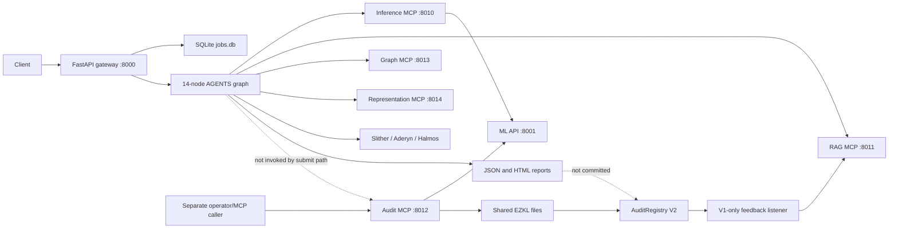
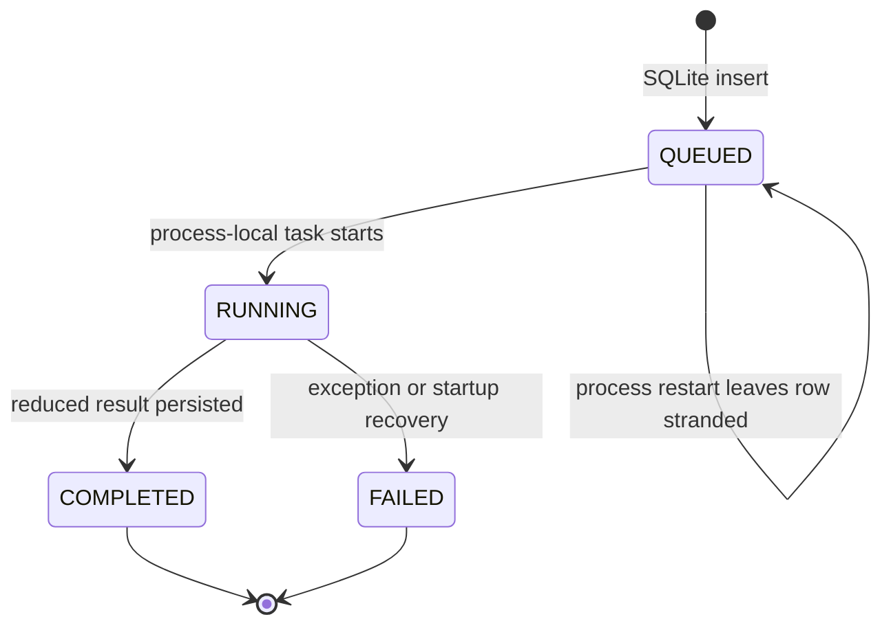

# SENTINEL D2 current executable architecture

**Runtime baseline:** `4b5bd333c63ab7a7ec83810fbbae54f3ebf1b493`
**Perspective:** executable source and tracked artifacts
**Readiness verdict:** single-host research system; not a production decentralized oracle

## Executive architecture

The baseline is two partially connected products:

1. an off-chain audit gateway that runs a 14-node AGENTS graph and writes address-named JSON/HTML reports; and
2. a separately invoked audit MCP path that asks ML for a 128-value fusion embedding, creates an EZKL proof for a 10-output proxy, and submits a V2 registry transaction.

They share source text and some model concepts, but they do not share one durable job, typed audit identity, execution manifest, deterministic evidence commitment, proof envelope, or finality state.

## Component ownership

| Boundary | Executable owner | Inputs | Outputs/state | Current trust property |
|---|---|---|---|---|
| DATA acquisition/release | `data_module/sentinel_data` | Mutable local/Git/manual sources | Raw/preprocessed/graph/token/split/export files | Partial per-file hashing; release manifest and exact inventory are not bound. |
| Teacher model | `ml/src` | Solidity source, local checkpoint, HF assets, solc/Slither | Ten probabilities, tiers, hotspots, 128-D embedding, model file hash | Probabilistic inference; train/serve tensor skew and unauthenticated load path. |
| Audit orchestration | `agents/src/orchestration` | Source, address, MCP/tool/LLM results | Evidence list, dual verdicts, report | Explicit state/evidence exists, but fallback/schema/reducer/report boundaries lose truth. |
| Gateway/jobs | `agents/src/api` | Public HTTP requests | SQLite rows and process-local tasks | Persistence without durable execution ownership, leases, retries, or bounded admission. |
| Local service mesh | five MCP SSE servers | Tool calls | ML/RAG/graph/representation/chain results | Broad bind, no application authentication, inconsistent health/mock semantics. |
| Proof system | `zkml/src`, `zkml/ezkl` | 128-D operator-supplied embedding | Ten proxy outputs and proof/public signals | Proves fixed proxy computation only; does not prove source, teacher, preprocessing, or audit. |
| On-chain registry | `contracts/src/AuditRegistry.sol` | Caller target/model hash, proof/signals, stake | V1/V2 histories/events | Verifies proof/output consistency but does not bind proof to target/model/round. |
| Feedback | `agents/src/ingestion/feedback_loop.py` | V1 events plus mutable local report | RAG content/index | Active V2 events are missed; proof semantics are overstated. |

## Off-chain gateway execution

`POST /audit` validates a request, inserts `QUEUED`, and starts one process-local `asyncio` task. `_run_job` marks it `RUNNING`, constructs the graph with checkpointing disabled, invokes it under one wall-clock timeout, reduces the graph result to a smaller response, and persists `COMPLETED` or `FAILED`.

There is no durable claim/lease owner, heartbeat, stage attempt, retry policy, cancellation acknowledgement, idempotency key, or dead-letter state. Startup recovery handles `RUNNING` but not stranded `QUEUED` work. The public gateway disables the graph checkpointer, so SQLite job persistence and graph recovery are separate mechanisms.

## AGENTS graph and evidence flow

The graph begins with ML assessment and quick screening, then routes to a fast or deep path. The deep path fans out to selected RAG/static/formal tools, joins at `audit_check`, and continues through consensus, cross-validation, synthesis, reflection, explanation, and visualization.

Positive local controls include typed `Evidence`, `tool_status`, configurable routing/verdict policy, prompt sanitation, deterministic LLM-disable mode, and separate full/provable verdict fields. The composition breaks those controls:

- inference transport failure can become plausible mock ML evidence with `ran=true`;
- derived consensus is counted as another evidence family beside its inputs;
- RAG production metadata does not reach the fusion emitter;
- `deterministic`/`provable` is an emitter assertion, not a manifest/proof property;
- parallel errors target a replace-valued state field;
- the final report and gateway envelope omit the complete status/evidence/dual-verdict record;
- report identity is user-derived and writes are non-atomic.

## Proof and submission flow

The audit MCP separately obtains the teacher fusion embedding, writes shared proof input/witness/proof paths, verifies the proof locally, and submits `submitAuditV2`. The proof has 138 public signals: 128 proxy inputs and 10 outputs. The contract receives target address and model hash separately.

The proof therefore establishes only:

> For the supplied 128 values, the fixed proxy circuit produced the supplied ten outputs.

It does not establish source bytes, deployed runtime code, teacher execution, preprocessing, DATA release, AGENTS tools/fusion, target, chain, reference block, model identity, report, operator set, or audit round. The same proof is accepted for different targets and caller-selected model hashes.

## Identity and hash inventory

| Object | Current identity | Gap |
|---|---|---|
| Request/job | Random gateway job ID plus free-form address | Not content-addressed; no chain/block/runtime code identity. |
| Source | Request bytes and local preprocessing hashes | No canonical source bundle or runtime-code relationship. |
| DATA release | Export artifact hash excluding semantic manifest fields | Does not commit exact release inventory/splits. |
| Teacher | SHA-256 checkpoint file hash after load | Not authenticated before unsafe deserialization; no preprocessing/export/toolchain binding. |
| AGENTS result | Address-named JSON and in-memory verdicts | No canonical deterministic commitment or immutable report content ID. |
| Proof | SHA-256 off-chain in one path; Keccak/proof-derived values on-chain | Algorithm/object semantics differ; public signals/identity are not one envelope. |
| Chain record | Target-keyed V1/V2 history | No round/manifest/evidence/report commitment. |

## Persistent state and concurrency

| State | Coordination | Failure mode |
|---|---|---|
| Gateway SQLite | Per-process lock | No distributed claim/lease; queued/running recovery incomplete. |
| LangGraph SQLite | Optional; gateway disables it | Cannot resume accepted gateway jobs. |
| Reports/HTML | Direct address-named writes | Path escape, partial writes, last-writer-wins. |
| RAG FAISS/BM25/chunks | Writer lock and per-file replacement | Multi-file generation is not atomic; feedback identity is mutable. |
| ML temp inputs | Global prefix cleanup | One process can unlink another process's live input. |
| ML inference threads | `wait_for(to_thread(...))` | Timeout returns while work continues; no admission bound. |
| EZKL files | Shared canonical paths | Concurrent jobs overwrite proof material. |
| Operator nonce | Direct RPC pending nonce | No per-key allocator/lock/idempotency. |
| Config/client globals | Import-time environment and cached singletons | Launch order/directory/test mutation changes behavior. |

## Deployment and security boundary

Gateway, ML, and five MCP processes default to broad host bindings. No route-level authentication/authorization dependency was found. The audit MCP contains a server-held operator signing key and a transaction-capable tool. Input limits, rate limits, tenant quotas, capability scopes, mTLS identity, signer policy enforcement, and bounded job admission are not composed into the application.

This does not prove every deployment is internet-routable. It proves the application does not supply the required trust boundary if the bind is reachable.

## Configuration and release topology

Configuration is split across `.env`, module-level environment reads, YAML, JSON, CWD-relative paths, and hard-coded defaults. `SENTINEL_CONFIG` names incompatible formats in ML and AGENTS. Dotenv override policy differs. Service URL variables and defaults disagree. There is no redacted startup config digest or single release manifest binding code, DATA, teacher, proxy, circuit/verifier, tools, policies, schemas, and deployment.

A clean clone lacks the DATA release, teacher checkpoint, compiler/HF bundle, proving prerequisites, Foundry dependency registration, some tests, and AGENTS knowledge seeds. Local success therefore depends on untracked workstation state.

## Current truth boundary

| Claim | Baseline can support it? | Reason |
|---|---|---|
| “Teacher predicts these probabilities” | Only for a locally loaded, incompletely identified runtime | Preprocessing/checkpoint/release bundle is not authenticated or reproducible. |
| “Deterministic tools produced this evidence” | Not as a committed system claim | Status/evidence/config/tool identities are incomplete or removed. |
| “EZKL proves the vulnerability result” | No | It proves proxy computation over supplied values only. |
| “This chain record belongs to this target/model audit” | No | Identity is outside proof and no quorum commitment binds it. |
| “Completed gateway job is finalized oracle output” | No | Gateway report and submission are disconnected. |
| “Independent operators reached quorum” | No | No round, active-set snapshot, attestations, or quorum exists. |

## Architecture disposition

The baseline is valuable research software with several reusable components, but its integrity controls do not compose. Production work must not begin by adding quorum around the current final labels: that would make divergent or fabricated executions harder to detect. Stabilization must first create immutable inputs, explicit degraded states, a canonical deterministic commitment, durable job ownership, and an authenticated signer boundary. V3 finality can then attest that commitment while leaving LLM/RAG narrative advisory.
