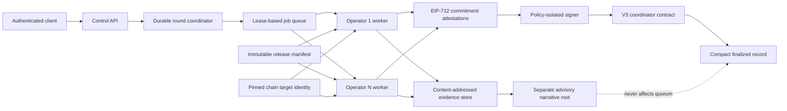
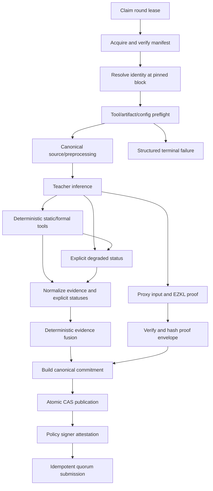
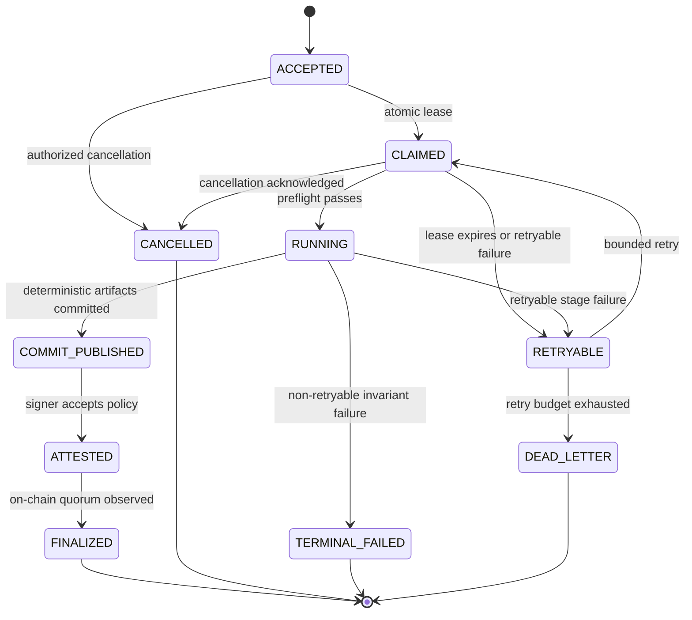
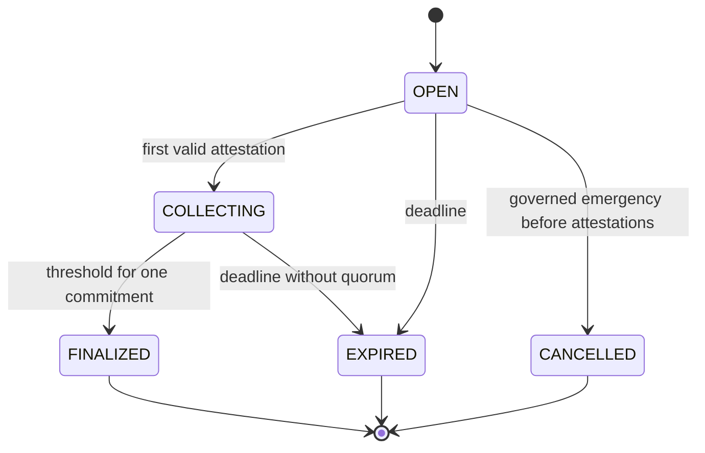

# SENTINEL V3 decision-complete target architecture

**Architecture state:** proposed for Ali review
**Pilot:** 5–9 governed, staked independent operators
**Evolution:** governed admission first; permissionless admission only after measured safety gates
**Consensus object:** canonical deterministic audit commitment
**Explicit exclusion:** LLM/RAG narrative never changes deterministic finality

## Architecture decision

V3 is a content-addressed, manifest-driven operator network. Each accepted request becomes one typed audit round. Independent operators acquire the same immutable release bundle and target identity, execute the deterministic pipeline, produce the same canonical commitment, and attest it using EIP-712. A coordinator finalizes after `ceil(2N/3)` unique active-set attestations. Detailed evidence remains content-addressed off-chain; compact identity, roots, manifest, signer bitmap, and finality are stored on-chain.

EZKL remains a bounded evidence component. It proves the fixed proxy computation for one canonical public-signal vector. It does not prove vulnerability truth, teacher execution, or the complete audit. The quorum attests that the target identity, pinned execution manifest, deterministic evidence, proxy proof envelope, and result belong together.



## Non-negotiable invariants

1. One round identifies one chain, deployed target/runtime-code state, reference block, manifest, and nonce.
2. A proof or attestation cannot be replayed across chain, coordinator, target, code hash, block, round, manifest, deadline, or nonce.
3. Missing, skipped, mock, degraded, or errored evidence is represented explicitly and cannot masquerade as a clean run.
4. Deterministic finality excludes LLM output, RAG ordering, free-form prose, timestamps, local paths, and nondeterministic tool data.
5. Every canonical input/output uses one versioned encoding shared by Python and Solidity test vectors.
6. Accepted work has durable ownership, lease, heartbeat, retry, cancellation, and idempotency semantics.
7. Signers authorize typed commitments only; analysis-facing processes never hold raw operator keys.
8. Operator membership, manifest, verifier, threshold, and deadline are immutable after round opening.
9. Finalized rounds are immutable. Upgrades create new versioned components and never reinterpret historical records.
10. Decision thresholds and capacity limits are versioned policy and change only with measurement.

## Canonical types

The normative wire encoding is EIP-712 typed data for attestations and Solidity ABI encoding for contract digests. Off-chain JSON is presentation only. Hash fields are `bytes32` Keccak-256 unless the type name explicitly declares another algorithm. Content-addressed files record both media type and digest algorithm in their descriptor.

```text
AuditIdentityV1 {
  uint256 chainId
  address target
  bytes32 runtimeCodeHash
  uint64 referenceBlock
  bytes32 sourceBundleHash       // zero only when source is unavailable by policy
  bytes32 roundId
}

ExecutionManifestV1 {
  bytes32 sourceReleaseHash
  bytes32 dataReleaseHash
  bytes32 graphSchemaHash
  bytes32 tokenizerHash
  bytes32 compilerSetHash
  bytes32 toolImageSetHash
  bytes32 teacherBundleHash
  bytes32 verdictPolicyHash
  bytes32 proxyBundleHash
  bytes32 circuitBundleHash
  bytes32 verifierIdentityHash
  bytes32 classLayoutHash
  bytes32 deterministicConfigHash
  bytes32 softwareReleaseHash
}

ProofEnvelopeV1 {
  bytes32 circuitId
  address verifier
  bytes32 verifierCodeHash
  bytes32 proofKeccak
  bytes32 publicSignalsKeccak
  bytes32 normalizedScoresHash
}

DeterministicCommitmentV1 {
  bytes32 identityHash
  bytes32 manifestHash
  bytes32 normalizedScoresHash
  bytes32 deterministicVerdictRoot
  bytes32 evidenceRoot
  bytes32 toolStatusRoot
  bytes32 proofEnvelopeHash
  bytes32 activeSetId
  uint64 deadline
  uint256 nonce
}

AdvisoryCommitmentV1 {
  bytes32 deterministicCommitmentHash
  bytes32 narrativeContentHash
  bytes32 ragSnapshotHash
  bytes32 llmProviderModelHash
  bytes32 promptTemplateHash
}
```

`sourceBundleHash` and `runtimeCodeHash` are separate because published source and deployed bytecode are not interchangeable. For historical audits, operators query a pinned archive RPC at `referenceBlock`, record RPC/provider evidence, and attest the runtime code hash. The on-chain coordinator validates the typed commitment and quorum; it cannot reconstruct historical code itself.

## Release and execution manifest

An operator may execute only a signed/content-addressed `SystemReleaseV1` whose descriptor binds:

- source commit and reproducible service images;
- DATA sources, label taxonomy/crosswalks, split groups, verification, graph/token shards, exact file inventory, and release hash;
- teacher checkpoint, thresholds, temperatures, drift baseline, tokenizer/HF snapshot, compiler/Slither revisions, preprocessing policy, graph schema, and class order;
- AGENTS deterministic policy, reliability matrix, evidence schema, tool images/versions, and prompt-independent routing configuration;
- proxy checkpoint, ONNX/external data, EZKL settings, compiled circuit, PK/VK identity, generated verifier bytecode, public-signal layout, and score encoding;
- deployed verifier/coordinator code hashes and chain addresses.

Promotion is transactional: validate every artifact and scientific gate, write the immutable descriptor, sign/approve it, then atomically make its hash eligible for new rounds. Partial file replacement never changes an active manifest. Rollback selects a previously approved complete manifest; it never mixes old weights with new transforms or circuits.

## Deterministic operator pipeline



Mock implementations are test transports only and cannot run under a production manifest. A tool result has a required status enum (`SUCCEEDED`, `CLEAN`, `DEGRADED`, `FAILED`, `SKIPPED_POLICY`, `UNAVAILABLE`) plus version, input hash, output hash, timing, attempt, and structured reason. Only the manifest defines whether a non-success status invalidates finality or enters the commitment as an allowed degraded result.

## Evidence and result model

Canonical evidence contains source family, vulnerability class, polarity, normalized strength, reliability-policy reference, location/hash, deterministic flag derived from the manifest, and provenance parents. Derived consensus can summarize parent evidence but cannot be counted as an independent witness. Correlated families are declared in the versioned policy and tested against calibration data.

`deterministicVerdictRoot` commits a class-ordered vector of verdict, normalized score, confidence/evidence tier, and reason-code—not narrative text. `evidenceRoot` commits sorted canonical evidence leaves. `toolStatusRoot` commits every expected tool, including tools that did not run. Class layout and score encoding come from the manifest and generated cross-language constants.

## Advisory LLM/RAG path

LLM debate, reflection, explanation, and RAG narrative run only after deterministic commitment publication. They may read canonical evidence and produce an `AdvisoryCommitmentV1` that points back to the deterministic commitment. Advisory output:

- cannot change deterministic scores/verdicts;
- cannot satisfy quorum or proof gates;
- is clearly labeled non-final and non-proven;
- is sanitized, size-bounded, tenant-authorized, and cost-budgeted;
- records model/provider/prompt/RAG snapshot identity when available.

## Durable job and round state

Off-chain job attempts and on-chain rounds are related but distinct.



Each stage is idempotent on `(roundId, operatorId, manifestHash, stageName, inputHash)`. Workers use isolated per-attempt workspaces. Outputs promote atomically into CAS. Leases have owner, generation, expiry, heartbeat, and cancellation token. Retry policy is typed by error class; invariant/security failures are never blindly retried.

## Operator set and quorum

The pilot active set contains 5–9 governed operators with stake. The snapshot is immutable per round. Threshold is `ceil(2N/3)`:

| N | Threshold |
|---:|---:|
| 5 | 4 |
| 6 | 4 |
| 7 | 5 |
| 8 | 6 |
| 9 | 6 |

One operator contributes at most one attestation per commitment. The contract rejects duplicate/inactive/post-snapshot signers, wrong EIP-712 domain, expired deadline, wrong nonce, and wrong manifest/verifier. EOAs are supported initially; ERC-1271 identities are adapter-based.

Conflicting valid signatures for the same `(roundId, operatorId)` are objective equivocation evidence. Slashing is limited to objectively verifiable faults: equivocation, invalid manifest identity, or prohibited replay. Accuracy disagreement without equivocation is not slashable. Stake unbonding exceeds the maximum round plus challenge duration.

## On-chain coordinator



The coordinator stores compact state:

- identity, manifest, deterministic commitment, evidence/status/proof roots;
- active-set ID and signer bitmap;
- finalization block/time and status;
- versioned verifier/circuit identity.

Proofs, public signals, signatures, complete reports, and evidence remain content-addressed off-chain. Contract adapters validate exact public-signal count, positions, encoding, range, verifier code hash, and proof envelope before a commitment can finalize. Verifiers are registered by immutable version; they are added or deprecated, never silently replaced for existing rounds.

## Authentication, authorization, and signer isolation

- Public API terminates behind mTLS/OIDC and tenant-scoped authorization.
- Health/readiness endpoints expose no mutation capability or secrets.
- MCP/tool services default to private loopback/service-network bindings with mutual service identity.
- Read, analyze, prove, attest, submit, administer, and emergency capabilities are distinct scopes.
- Body size, request rate, concurrent jobs, tenant storage, LLM cost, and proof capacity are measured policies in versioned configuration.
- Operator keys live in HSM/KMS or a minimal signer service. The signer accepts only canonical typed commitments, validates manifest eligibility, operator/round identity, deadline, nonce, and local execution receipt, then returns a signature. It cannot accept arbitrary transaction calldata.

## Configuration and observability

Every process has one typed, service-prefixed configuration schema with precedence `CLI > environment > versioned file > defaults`. Production forbids dotenv override. Startup fails closed on unknown keys, incompatible schema, missing artifacts, wrong hashes, mock mode, unresolved endpoints, or unavailable required tools. Each process emits a redacted config digest and release/manifest hash.

One trace context carries `requestId`, `roundId`, `operatorId`, `attemptId`, `manifestHash`, and `commitmentHash`. Required telemetry includes queue depth, lease age, stage/tool latency, degraded/mock rejection, artifact mismatch, proof time, signer decisions, transaction state, quorum progress, event lag, retries, cancellation, and dead letters. Metrics use bounded labels; detailed hashes remain in structured logs/traces.

## Governance

- Multisig plus timelock controls operator admission/removal, manifest eligibility, verifier activation/deprecation, pause, and upgrades.
- Emergency guardian may pause new rounds/submissions but cannot upgrade, seize stake, alter finalized records, or replace manifests.
- Parameter changes activate only after delay and do not affect open rounds.
- Upgrade tests prove storage layout and V1/V2 read compatibility.
- Permissionless admission is a later governed transition requiring measured Sybil/economic, recovery, performance, and disagreement evidence; it is not implicit in the pilot.

## Compatibility, migration, and rollback

1. Contain public signing/mock/path/export/proof-replay P0s on the current line.
2. Publish immutable DATA, teacher, deterministic-policy, proxy/circuit/verifier, and tool bundles.
3. Introduce canonical Python/Solidity types and golden hash vectors.
4. Deploy durable workers, CAS, authenticated services, and policy signer in single-operator shadow mode.
5. Deploy new operator vault, verifier registry, and V3 coordinator; preserve V1/V2 reads.
6. Run 5–9 operators in shadow mode and compare byte-identical commitments, degraded-state handling, latency, proof gas, recovery, and disagreement.
7. Enable governed V3 writes after all acceptance gates pass.
8. Deprecate or pause legacy writes; never reinterpret legacy records as V3 finality.

Rollback pauses new V3 rounds and reselects the last approved complete release manifest. Finalized V3 records remain immutable. V1/V2 historical reads remain available through versioned adapters and feedback decoders.

## Required acceptance tests

- Cross-chain/coordinator/target/code/block/source/model/manifest/round/deadline/nonce replay rejection.
- Shared Python/Solidity digest vectors and canonical evidence Merkle vectors.
- Same proof against another identity or manifest fails.
- Exact signal layout, score range, verifier code hash, and circuit ID enforcement.
- Thresholds and signer bitmap for every N=5…9.
- Duplicate/inactive/exiting/post-snapshot/contract-wallet operators.
- Objective equivocation, stake lock, unbonding, pause, and timelocked upgrade.
- Worker kill/restart at every stage, lease reclaim, retry exhaustion, cancellation, and two-worker idempotency.
- Concurrent proof workspaces and per-key transaction allocation.
- Missing/wrong artifact, compiler, tool, config, checkpoint, and mock-mode failure.
- Byte-identical deterministic commitments across independent clean operators.
- Advisory output cannot mutate commitment or finality.
- V1/V2 event/read migration and reorg-safe exactly-once feedback ingestion.
- Fresh-clone/bootstrap, offline hash verification, clean CPU/GPU/container suites.
- Measured DATA, teacher, AGENTS, proof, transaction, quorum, recovery, gas, storage, and observability gates.

## Decision completeness

Architecture choices are fixed for implementation planning: identity fields, hash/encoding boundary, manifest contents, deterministic/advisory separation, durable job semantics, quorum formula, operator-set snapshot, state machines, proof truth boundary, signer isolation, storage model, governance, compatibility, and migration order. Remaining unknowns are measurements—capacity, latency, gas, storage, accuracy, disagreement, and policy thresholds—and must be derived from the remediated implementation rather than guessed in this document.
