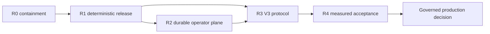

# SENTINEL D2 remediation roadmap

**Input:** unified D2 registry and V3 target architecture
**Status:** approved for R0 implementation planning; each wave requires matrix and before/after evidence
**Ordering rule:** compatibility-preserving stabilization before protocol redesign

## Roadmap contract

Each work package gets its own plan, branch, tests, measurement record, rollback unit, and review. A wave closes only when every exit gate has immutable evidence in the acceptance matrix. Passing unit tests alone never closes scientific, security, reproducibility, or operational requirements.

No threshold, weight, confidence, quorum parameter beyond the locked pilot decision, timeout, capacity, or gas policy changes without before/after measurement. Quorum is fixed architecturally as `ceil(2N/3)` for the governed 5–9 pilot; other policy numbers must be derived.

## Dependency sequence

## R0 — Contain trust and security blockers

### R0.1 Fail closed on production evidence

- Remove implicit inference/chain mock fallback from live transport.
- Introduce mandatory typed dependency/tool status and propagate it through state, report, gateway, evaluation, proof/finality gates, and health/readiness.
- Reject mock/degraded evidence under production/deterministic manifests.
- Canonical IDs: `D2-AGT-001`, `D2-AGT-004`, `D2-AGT-012`, `D2-AGT-016`.

Exit evidence: outage/timeout/init-failure tests prove `ran=false` or terminal failure; health reports `live/degraded/mock/unavailable`; no evidence/proof/finality output is emitted from mock transport.

### R0.2 Contain filesystem inputs

- Validate chain addresses and separate logical identity from storage names.
- Resolve and enforce report/CAS containment; use atomic per-job workspaces.
- Replace ZIP prefix validation with resolved-path containment; reject links/special files and enforce extraction limits.
- Canonical IDs: `D2-AGT-002`, `D2-DATA-001`.

Exit evidence: traversal/symlink/sibling-prefix/absolute-path/Unicode/archive-bomb cases fail without writes outside temporary roots.

### R0.3 Establish service and signer boundaries

- Default-bind private/loopback interfaces.
- Add authenticated/authorized API gateway and service identity.
- Separate analyze/prove/submit/admin scopes, rate/body/concurrency/storage limits, and audit logging.
- Remove raw operator key from MCP; introduce a policy signer that accepts typed commitments only.
- Canonical IDs: `D2-X-001`, `D2-AGT-011`, `D2-ZKC-014`.

Exit evidence: unauthenticated requests receive 401/403; scope/tenant/limit tests pass; analysis process contains no signing secret; signer rejects arbitrary calldata and mismatched identity/manifest/round.

### R0.4 Stop unbound or falsely successful chain writes

- Pause/deprecate V2 write claims as “verified audit” until typed identity binding exists, or label them explicitly legacy/proxy-only.
- Estimate gas; treat reverted/failed receipts as failure; add idempotency and pending/final receipt states.
- Canonical IDs: `D2-ZKC-001`, `D2-ZKC-003`, `D2-ZKC-002`.

Exit evidence: cross-target/model/chain replay cannot create a V3-style verified claim; receipt failure is surfaced; no fixed-gas submission is reported successful after revert.

### R0.5 Freeze unsafe releases

- Stop promoting exports/checkpoints/proof bundles through gates that do not bind complete content.
- Authenticate artifact descriptors before any unsafe/deserializing load.
- Canonical IDs: `D2-DATA-002`, `D2-ML-004`, `D2-ML-005`, `D2-ML-013`.

Exit evidence: deletion/addition/manifest mutation/wrong checkpoint/probe absence causes pre-load failure. No existing experiment artifact is deleted; rollback retains the current bundle as explicitly legacy/untrusted.

## R1 — Build one deterministic release and result contract

### R1.1 DATA release v2

- Immutable source snapshots and append-only provenance.
- Solidity-aware normalization or content-addressed source bundles; compile exact stored bytes.
- Atomic graph/token/label/ID join.
- Deterministic global dedup independent of worker count.
- Group-aware split with required leakage audit and globally applied class policy.
- Fail-closed verification artifact required by export.
- Insert-once final export registration and complete file/semantic manifest commitment.
- IDs: `D2-DATA-003`–`013`.

Exit evidence: clean bootstrap; repeated multi-worker builds are byte-identical; alignment/leakage/mutation tests pass; released descriptor binds every expected file, split, schema, tool, label, and verification result.

### R1.2 ML semantic correction and immutable bundle

- Fix categorical type decode and determine retraining requirement from frozen shadow comparisons.
- Unify offline/online source policy, tokenizer revision, window selection, pad IDs, masks, and pooling.
- Replace unrestricted artifact loads or authenticate before load in a constrained format/process.
- Create complete teacher bundle: checkpoint, thresholds, temperatures, drift baseline, DATA release, preprocessing/schema, compiler/HF/toolchain, software image.
- Type no-contract/error responses and bound inference admission/cancellation.
- Correct hotspot naming/semantics; apply or explicitly retire calibration based on measured evaluation.
- IDs: `D2-ML-001`–`020`, `022`.

Exit evidence: golden tensor equivalence; exhaustive node IDs; clean CPU/GPU/container tests; checkpoint bundle hash verified before load; retraining/calibration decision has before/after held-out results.

### R1.3 Canonical evidence/result schema

- Required tool-status enum and structured multi-error model.
- Canonical evidence provenance parents and correlation groups.
- Derived consensus cannot count as independent evidence.
- Production RAG metadata/score normalization is tested; RAG remains advisory unless made canonical.
- Full/provable naming is replaced by deterministic/advisory/proof-scope-accurate terminology.
- Gateway/report/CAS expose the complete result contract.
- IDs: `D2-AGT-003`, `004`, `009`, `010`, `014`, `016`, `020`.

Exit evidence: production-shaped seam tests; parent-correlation invariants; empty/failed/degraded evidence cases; gateway/CAS round-trip retains byte-identical canonical commitment fields.

### R1.4 System manifest and cross-language types

- Implement `AuditIdentityV1`, `ExecutionManifestV1`, `ProofEnvelopeV1`, `DeterministicCommitmentV1`, and `AdvisoryCommitmentV1`.
- Generate class/signal/version constants from one schema.
- Publish Python/Solidity digest and Merkle golden vectors.
- Transactionally promote DATA/teacher/policy/proxy/circuit/verifier/tool images as one eligible release.
- IDs: `D2-X-003`, `005`, `007`, `008`, `D2-ZKC-005`–`009`, `013`, `015`, `018`.

Exit evidence: clean operator bootstrap resolves one manifest; any artifact mutation fails; Python/Solidity hashes match; old/new schema adapters are explicit.

## R2 — Durable authenticated operator execution

### R2.1 Durable job control plane

- Content-addressed request/round ID and idempotency key.
- Durable queue with atomic claims, leases, heartbeats, generation, bounded retries, dead letters, cancellation, and backpressure.
- Stage-level idempotency and graph checkpoints use the same job identity.
- IDs: `D2-AGT-005`, `015`, `017`, `D2-X-004`.

Exit evidence: process kill at every stage, queued/running recovery, expired lease reclaim, two workers, duplicate request, cancellation, poison job, and retry exhaustion.

### R2.2 Isolated proof and transaction workers

- Per-attempt proof workspace and atomic CAS promotion.
- Per-operator nonce allocator/lock, replacement transaction policy, and receipt state machine.
- IDs: `D2-ZKC-004`.

Exit evidence: concurrent proof jobs cannot cross-contaminate; multiple transactions have unique managed nonces; restart/reorg/replacement tests reconcile one final state.

### R2.3 Atomic reports, RAG, and feedback

- Reports keyed by commitment/content ID, not address.
- Atomic report publication and generation-swapped RAG indexes.
- Versioned V1/V2/V3 event inbox keyed by `(chainId, txHash, logIndex)`; reorg-safe retry and checkpoint after durable inbox commit.
- Truthful proxy/quorum semantics in feedback.
- IDs: `D2-AGT-019`, `D2-X-006`.

Exit evidence: concurrent same-target rounds remain distinct; partial index update is never visible; event duplicates/reorg/lock failure/missing report recover exactly once.

### R2.4 Observability and SLO evidence harness

- Propagate request/round/operator/attempt/manifest/commitment IDs.
- Structured logs, traces, bounded metrics, alert tests, dependency state, queue/lease/stage/tool/proof/transaction/quorum/event-lag telemetry.
- IDs: `D2-AGT-007`, `D2-ML-017`, `020`, `D2-X-010`.

Exit evidence: a test run can be reconciled from request through feedback; degraded/mock/artifact mismatch/retry/cancel signals are observable; alert tests pass.

## R3 — Implement V3 quorum and governance

### R3.1 Operator vault and active-set snapshots

- Governed registration plus stake for the pilot.
- Immutable per-round active-set ID; support 5–9 operators.
- Stake locking/unbonding and objective equivocation evidence.
- IDs: `D2-ZKC-010`, `011`.

### R3.2 Verifier registry and typed coordinator

- Versioned verifier/circuit/signal-layout registry.
- Round state machine `OPEN → COLLECTING → FINALIZED` or `EXPIRED/CANCELLED`.
- EIP-712 commitment, domain separation, deadline/nonce, unique signer bitmap, `ceil(2N/3)` threshold.
- Compact roots/identity/manifest storage; content-addressed detail off-chain.
- IDs: `D2-ZKC-001`, `002`, `007`–`011`, `015`, `D2-X-002`, `005`, `008`.

### R3.3 Governance and compatibility

- Multisig + timelock for membership, manifests, verifiers, pause, upgrades.
- Pause-only emergency guardian.
- Preserve V1/V2 reads/events; versioned adapters; shadow V3; governed write cutover.
- IDs: `D2-ZKC-009`, `012`, `015`, `D2-X-006`.

Exit evidence for R3: all N=5…9 thresholds; replay/equivocation/operator lifecycle tests; real verifier and shared digest vectors; storage-layout upgrade; worst-case gas/storage measurement; V1/V2 compatibility and reorg-safe migration.

## R4 — Measure and decide production readiness

### Scientific gates

- DATA release leakage, label quality, coverage, and benchmark validity.
- Teacher held-out per-class precision/recall/Fβ, calibration, unsupported-class policy, drift, train/serve equivalence.
- Teacher/proxy agreement and proof-scope accuracy.
- Fusion reliability and correlated-evidence ablation.
- Independent operators produce byte-identical commitments under the same manifest.

### Operational gates

- DATA throughput/memory and clean rebuild.
- Teacher CPU/GPU latency, throughput, VRAM, timeout/cancellation, concurrent admission.
- End-to-end deterministic and advisory latency/cost separately.
- Worker crash/recovery, queue saturation, multi-operator disagreement, RPC/reorg behavior.
- Proof time, V3 finalization latency, worst-case real-verifier gas, nine-attestation gas, storage growth.
- Security tests for auth, quotas, signer policy, artifact supply chain, archive/path handling, replay, and governance.

### Permissionless transition gate

Permissionless admission is not part of pilot launch. It requires separate measured evidence for Sybil resistance, minimum economic security, stake concentration, liveness under churn, slashing appeals, operator software reproducibility, and governance capture resistance.

## Rollback units

| Wave | Rollback unit |
|---|---|
| R0 | Last safe service image/config with public writes paused and explicit legacy labeling |
| R1 | Complete immutable system manifest; never individual artifact files |
| R2 | Worker/control-plane release plus compatible schema migration and CAS generation |
| R3 | Pause new rounds; retain finalized records and V1/V2/V3 read adapters; select prior eligible manifest/verifier for new rounds only |
| R4 | No behavioral rollback from a failed measurement; return to the responsible implementation wave |

## Implementation authorization boundary

Ali approved D2 on 2026-07-14 with the condition that every R0–R4 wave closes only through the acceptance matrix and measured before/after evidence. Approval starts R0 planning; it does not waive plan review, measurement, security review, migration rehearsal, or production deployment gates.
