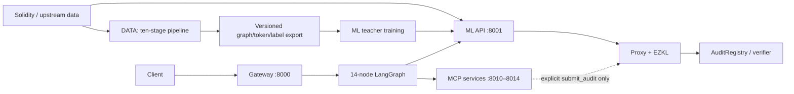

# 01 — Current architecture

**Read this when:** you need the whole-system topology, ownership boundaries, processes, ports, or deployment trust model.

**Skip this if:** never before operating or changing more than one module.

**Estimated reading time:** 12 minutes.

## 30-second summary

SENTINEL has five source modules and multiple runtime processes. DATA builds trustworthy versioned training artifacts. ML serves four-eye predictions and fusion embeddings. AGENTS orchestrates evidence and exposes gateway/MCP services. ZKML proves a small proxy computation. Contracts gate submissions by stake and proof and store audit history. The main architectural caveat is that gateway audits and direct ZK/on-chain submissions are separate paths.

## Just-enough mental model



The dotted submission connection is not invoked by the normal gateway graph.

## Actual runtime/source walkthrough

### Module ownership

| Module | Primary responsibility | Runtime/build outputs |
|---|---|---|
| [`data_module`](../../data_module) | acquire, normalize, represent, label, verify, split, register, analyze, export, freshness | ignored/local datasets, manifests, reports, catalogs |
| [`ml`](../../ml) | teacher architecture, training, inference, calibration, drift, MLOps | checkpoint companions, API responses, metrics |
| [`agents`](../../agents) | orchestration, evidence, RAG, MCP, gateway, feedback, eval | reports, jobs, indexes, state/eval evidence |
| [`zkml`](../../zkml) | proxy distillation, ONNX, EZKL setup/proof | model/circuit/key/proof artifacts |
| [`contracts`](../../contracts) | stake, verification, V1/V2 storage, upgrades/deployment | deployed token/verifier/registry and events |

### Runtime processes and ports

| Process | Default port | Boundary |
|---|---:|---|
| Gateway | 8000 | public async job API |
| ML FastAPI | 8001 | source inference and fusion embedding |
| inference MCP | 8010 | MCP wrapper over ML |
| RAG MCP | 8011 | hybrid retrieval |
| audit MCP | 8012 | chain reads plus explicit proof/submission |
| graph inspector MCP | 8013 | hotspot analysis |
| representation MCP | 8014 | function CFG structural data |
| Anvil | 8545 | optional local chain |

Gateway jobs persist in SQLite. LangGraph has its own SQLite checkpointer when available. RAG indexes, caches, reports, and databases are local runtime artifacts unless explicitly promoted.

### Trust boundaries

- Solidity and external reports are untrusted inputs.
- DATA validation/provenance controls corpus trust; they do not guarantee label truth.
- ML outputs are learned evidence, not proof.
- analyzers/formal tools have explicit availability/failure states.
- RAG/LLM outputs are nondeterministic supporting evidence.
- the operator supplies proof inputs, model hash, transaction authority, and provenance claims.
- EZKL proves only proxy computation.
- AuditRegistry is owner-upgradeable and economically gates the submitting address.

## Interfaces, data shapes, and configuration

The principal boundaries are:

1. DATA export → `SentinelDataset`: v9, graph `[N,12]`, tokens `[4,512]`, labels `[10]`.
2. ML → AGENTS: ten probabilities/tiers, eye signals, model hash, hotspots.
3. ML → ZKML: fusion embedding `[128]`.
4. ZKML → registry: proof plus 138 public signals and ten score fields.
5. AGENTS → client: asynchronous job plus evidence-rich final report.

Configuration is module-scoped. Shared compatibility values are mirrored in [`handbook.toml`](_meta/handbook.toml) and explained in [cross-module contracts](11_cross_module_contracts.md).

## Failure modes and current limitations

- Multiple services can be healthy independently while an end-to-end path is incomplete.
- Gateway completion is off-chain only; on-chain placeholder fields are not transaction evidence.
- Fresh clones lack several large/private/local artifacts.
- Mock/fallback/degraded responses must not be mixed with live evidence.
- Owner and operator keys remain centralized trust points.
- Local databases and shared proof paths limit horizontal/concurrent production behavior.

## Common change recipe

For an architectural change:

1. Name the module owner and cross-module interface.
2. Update source producer/consumer with versioned compatibility tests.
3. Re-evaluate process, port, artifact, failure, and trust boundaries.
4. Run affected module and live flows.
5. Update architecture, runtime flows, cross-module contracts, security, operations, metadata, and status.

## Verification commands

```bash
python3 docs/handbook/tools/verify_handbook.py static
python3 docs/handbook/tools/verify_handbook.py inventory
python3 docs/handbook/tools/verify_handbook.py live --services
```

## Optional deep references

- [Runtime flows](02_runtime_flows.md)
- [Cross-module contracts](11_cross_module_contracts.md)
- [Security and trust](12_security_and_trust.md)
- [Current status](16_current_status.md)

## Technical mastery layer

### Prerequisite knowledge

Know process boundaries, ports, HTTP request lifecycles, artifacts, and trust boundaries. Read [the handbook workflow](00_README.md) first.

### Source map and reading order

Read gateway `agents/src/api/gateway.py::create_app`, graph `agents/src/orchestration/graph.py::build_graph`, ML `ml/src/inference/api.py::lifespan`, audit MCP `agents/src/mcp/servers/audit/_submit.py::_run_submit`, and registry `contracts/src/AuditRegistry.sol::submitAuditV2`. Continue with [T10](technical/10_end_to_end_debugging.md).

### Execution trace and worked example

A gateway request crosses process boundaries at gateway 8000 and ML 8001, then may call MCP services 8010–8014. It ends as an off-chain report. Only the separate audit-MCP flow crosses EZKL and registry/Anvil 8545. Drawing one arrow from gateway completion directly to registry is therefore incorrect current architecture.

### Implementation practice

Before adding a process, declare owner, port, routes/tools, health semantics, secrets, persistent state, upstream/downstream contracts, startup order, tests, and failure isolation. Exercise the complete map in [L10](labs/10_end_to_end_capstone.md).

### Review and ownership check

Can you identify which process owns each mutable state, which links are network versus files, and which boundaries are cryptographic versus operator-asserted?
