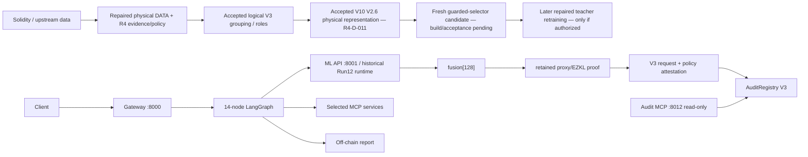

# 01 — Current architecture

**Read this when:** you need the whole-system topology, ownership boundaries, processes, ports, or deployment trust model.

**Skip this if:** never before operating or changing more than one module.

**Estimated reading time:** 12 minutes.

## 30-second summary

SENTINEL has five main source modules but two distinct current directions: the off-chain analysis runtime and the repaired DATA/ML lifecycle. Historical R4 G0–G7 remain PASSED; Phase 8 is IN_PROGRESS. The DATA/ML path now includes accepted repaired-v2 physical DATA, accepted logical V3 grouping/roles, and the R4-D-011 V10 V2.6 physical representation. R4-D-012 authorizes guarded selection only for a fresh candidate that still requires separate physical acceptance; full training remains unauthorized. The live audit MCP is read-only. The registry's current submission protocol is V3, which combines the retained proxy-computation proof with a separate EIP-712 policy/context attestation. No current claim says the ZK circuit proves teacher/source/AGENTS execution.

## Just-enough mental model


```mermaid
flowchart LR
  U["Solidity / upstream data"] --> D["Repaired physical DATA + R4 evidence/policy"]
  D --> V3L["Accepted logical V3 grouping / roles"]
  V3L --> V10["Accepted V10 V2.6 physical representation — R4-D-011"]
  V10 --> GC["Fresh guarded-selector candidate — build/acceptance pending"]
  GC --> M["Later repaired teacher retraining — only if authorized"]

  C["Client"] --> G["Gateway :8000"]
  G --> L["14-node LangGraph"]
  L --> API["ML API :8001 / historical Run12 runtime"]
  L --> S["Selected MCP services"]
  L --> REP["Off-chain report"]

  API --> F["fusion[128]"]
  F --> Z["retained proxy/EZKL proof"]
  Z --> P["V3 request + policy attestation"]
  P --> R["AuditRegistry V3"]

  RO["Audit MCP :8012 read-only"] --> R
```

The gateway does not submit a transaction. The audit MCP observes V1/V2/V3 history but does not expose runtime signing/broadcast. The V3 protocol boundary exists in source/contracts; a production signer/broadcaster is not claimed.

## Actual runtime/source walkthrough

### Module ownership

| Module | Current responsibility | Important current state |
|---|---|---|
| [`data_module`](../../data_module) | ingestion, preprocessing, representations, historical exports, DATA vNext/R4 implementation | repaired-v2 physical DATA accepted; logical V3 accepted; V10 V2.6 physical representation accepted; guarded-token successor pending separate acceptance |
| [`ml`](../../ml) | four-eye teacher, Run12 inference, future repaired retrain | Run12 remains historical operational baseline; no repaired R4 teacher promoted; full training unauthorized |
| [`agents`](../../agents) | orchestration, evidence, RAG, MCP, gateway, feedback, V3 observation | audit MCP live surface is read-only; V3 feedback policy remains intentionally unavailable |
| [`zkml`](../../zkml) | retained proxy distillation/ONNX/EZKL proof boundary | proof is proxy-only/unbound by itself; future regeneration follows a selected repaired teacher |
| [`contracts`](../../contracts) | staking, verifier, V1/V2 historical storage, V3 context-attested protocol, UUPS upgrades | V3 initialization disables new legacy V1/V2 writes while preserving reads/history |

### Runtime processes and ports

| Process | Default port | Boundary |
|---|---:|---|
| Gateway | 8000 | async off-chain audit jobs |
| ML FastAPI | 8001 | source inference / hotspots / fusion embedding |
| inference MCP | 8010 | ML wrapper |
| RAG MCP | 8011 | retrieval |
| audit MCP | 8012 | **read-only version-aware registry observation** |
| graph inspector MCP | 8013 | hotspot/graph inspection |
| representation MCP | 8014 | CFG/representation structural data |
| Anvil | 8545 | optional local chain for contract testing/deployment exercises |

Gateway/graph reports, RAG indexes, caches, databases, and proof workspaces are separate local/runtime state unless explicitly promoted.

### DATA/ML architecture in current Phase 8

R4 no longer interprets the historical population as ten trustworthy binary targets. The semantic policy preserves unknown state rather than manufacturing negatives, and the current physical/logical lineage has evolved through several versioned decisions:

```text
historical G0–G7 evidence
→ R4-D-008 repaired-v2 physical DATA
→ R4-D-009 logical V3 grouping / roles
→ R4-D-010 withdraw v9 from new-full-training eligibility
→ R4-D-011 accept exact V10 V2.6 physical representation
→ R4-D-012 authorize guarded selection for a fresh successor candidate
→ separate candidate generation/binding/physical acceptance
→ objective/evaluation/threshold/calibration support
→ explicit later training authorization, if evidence permits
```

No historical zero is promoted to a confirmed negative. Confirmed negatives remain zero. GasException and UnusedReturn remain supervision-disabled under policy v1. Threshold-fit, calibration-fit, and untouched-acceptance roles are intentionally unsupported/empty. The accepted V10 physical lineage is not itself training authorization.

### Representation boundaries

Two representation statements must be kept separate:

1. **Historical/reproducibility boundary:** graph schema v9 remains immutable accepted evidence for historical reproduction, with token tensors `[4,512]`.
2. **Current possible future-training physical boundary:** R4-D-011 accepts graph schema v10 under extractor `v2.6-r4-call-semantics-deterministic-cfg-mutators` for the exact 22,540-identity root. R4-D-012 then requires a fresh versioned token lineage using `target_aware_guarded_v1`; that successor has not yet been separately accepted.

The model architecture remains frozen while these data/representation/evaluation gates are resolved.

### V3 trust boundary

`AuditRegistry.submitAuditV3` binds the submitting agent, target bytecode hash, round, teacher-model hash, proxy-bundle hash, DATA-version hash, class-schema hash, proof hash, public-signal hash, ten-score hash, deadline, chain ID, and registry address through an EIP-712 policy signature. It still verifies the retained proxy proof separately.

That produces two distinct claims:

1. **ZK claim:** the fixed proxy computation is valid for the supplied public inputs/outputs.
2. **policy/provenance claim:** an authorized signer attested that this fully bound audit context is eligible for V3 submission.

Neither claim says the circuit proved Solidity compilation, teacher execution, LangGraph routing, or the final AGENTS verdict.

## Interfaces, data shapes, and configuration

Principal compatibility boundaries:

1. Historical representations: v9 graph `x[N,12]`, tokens `[4,512]`, locked ten-class order; reproducibility only for a new-full-training decision.
2. Current physical representation authority: accepted V10 V2.6 graph lineage; guarded-selector successor token lineage pending separate acceptance.
3. R4 semantic layer: contract×class outcome/training state plus leakage-safe dataset role; historical binary v1 is compatibility history, not new truth.
4. ML → AGENTS: ten probabilities/tiers, eye signals, model hash, hotspots.
5. ML → ZKML: fusion embedding `[128]`.
6. ZKML proof: 128 public inputs + 10 public outputs = 138 public signals.
7. V3 registry context: proof/output identities plus target/model/data/schema/request identities and policy signer.
8. AGENTS → client: asynchronous off-chain report.

See [cross-module contracts](11_cross_module_contracts.md) for exact meanings and [current status](16_current_status.md) for gate state.

## Failure modes and current limitations

- A healthy gateway/ML/MCP topology does not imply a production chain-submission service exists.
- Gateway completion is off-chain only.
- The audit MCP must not be treated as a transaction signer/broadcaster.
- Run12 predictions/thresholds remain historical-baseline behavior until repaired retraining occurs.
- R4-D-011 physical acceptance does not authorize repaired full training.
- R4-D-012's guarded selector still needs a fresh physically accepted token lineage.
- Confirmed negatives remain zero; candidate #2 still requires genuinely independent agreement.
- Threshold/calibration/untouched-acceptance support remains unavailable.
- The retained EZKL bundle remains legacy proxy scope and `check_mode="UNSAFE"`; V3 context binding does not expand the circuit statement.
- Owner/policy-signer/operational key management remains a trust/governance boundary.

## Common change recipe

For an architectural change:

1. Identify whether it affects historical compatibility, R4/DATA vNext, runtime analysis, or V3 submission protocol.
2. Name producer/consumer semantics before touching shapes.
3. Add mismatch/failure tests.
4. Preserve old artifacts and version new semantics unless an approved migration says otherwise.
5. Re-evaluate DATA roles, ML retraining, proxy/circuit, V3 hashes/signature, MCP exposure, and documentation as applicable.
6. Update current status and governing R4/ADR records.

## Verification commands

```bash
python3 docs/handbook/tools/verify_handbook.py static
python3 docs/handbook/tools/verify_handbook.py inventory
python3 docs/handbook/tools/verify_handbook.py live --services
```

The live services command verifies process availability only. Contract/ZK/live signer claims require separate explicit evidence.

## Optional deep references

- [Runtime flows](02_runtime_flows.md)
- [Cross-module contracts](11_cross_module_contracts.md)
- [Security and trust](12_security_and_trust.md)
- [Current status](16_current_status.md)
- [R4 master plan](../plan/ml-R4/00_MASTER_PLAN.md)

## Technical mastery layer

### Prerequisite knowledge

Know process boundaries, versioned artifacts, dataset leakage roles, HTTP/MCP, EIP-712, proxy proofs, and UUPS storage compatibility.

### Source map and reading order

Read gateway `agents/src/api/gateway.py::create_app`, graph `agents/src/orchestration/graph.py::build_graph`, live audit server `agents/src/mcp/servers/audit/_server.py::run_server`, read-only handlers, policy signer `agents/src/security/policy_signer.py`, registry `contracts/src/AuditRegistry.sol::submitAuditV3`, then current R4 policy/role/representation decisions. Do not use historical `_submit.py` as the live runtime entry point.

### Execution trace and worked example

A normal client request reaches gateway 8000, runs the LangGraph with ML/tool evidence, and ends as an off-chain report. Separately, the current DATA/ML repair path has accepted the V10 V2.6 physical representation but still requires a fresh guarded-selector successor and later evidence/design gates before any repaired training authorization. A V3 submission system would need a valid proxy proof plus a fully bound policy-signed request and transaction authority outside the analysis MCP. The audit MCP can then read the resulting V1/V2/V3 history.

### Implementation practice

Before adding a process or cross-module path, declare its trust domain, signing authority, artifact/hash inputs, network boundary, persistent state, failure semantics, and whether it is actually connected to the default gateway flow.

### Review and ownership check

Can you draw the off-chain analysis path, current DATA/ML repair path, and V3 proof/attestation path separately and state which arrows are implemented, historical, accepted-but-not-training-authorized, candidate, or intentionally outside the analysis service?
