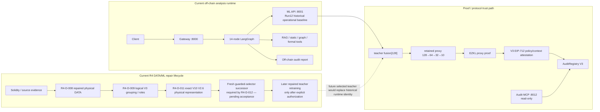

# 01 — Current architecture

**Read this when:** you need the canonical whole-system topology, module ownership, runtime path, DATA/ML lifecycle, or proof/attestation trust boundaries.

**Skip this if:** you only need one subsystem implementation detail; use the owning chapter after orienting here.

**Estimated reading time:** 12 minutes.

## 30-second summary

SENTINEL has five main source modules and three architectural tracks that must not be collapsed into one pipeline:

1. **Current off-chain audit runtime** — the gateway runs a 14-node LangGraph and currently consumes the historical Run12 ML runtime.
2. **Current R4 DATA/ML repair lifecycle** — accepted repaired DATA, logical V3 grouping/roles, and the exact R4-D-011 V10 V2.6 physical representation are preparing a trustworthy future-training boundary. R4-D-012 permits guarded selection only in a fresh successor candidate; full repaired training remains unauthorized.
3. **Proof / on-chain trust path** — the retained 128→10 proxy proof and the V3 EIP-712 policy/context attestation are separate trust claims. Signing/broadcast remains outside the live analysis MCP, which is read-only.

The canonical architecture views below own those questions. Other handbook pages explain their mechanics but should not redefine the topology.

## Just-enough mental model

### Canonical view A — whole system and ownership


```mermaid
flowchart LR
  subgraph RUNTIME["Current off-chain analysis runtime"]
    C["Client"] --> G["Gateway :8000"]
    G --> L["14-node LangGraph"]
    L --> M["ML API :8001\nRun12 historical operational baseline"]
    L --> TOOLS["RAG / static / graph / formal tools"]
    L --> REP["Off-chain audit report"]
  end

  subgraph R4["Current R4 DATA/ML repair lifecycle"]
    U["Solidity / source evidence"] --> D8["R4-D-008 repaired physical DATA"]
    D8 --> D9["R4-D-009 logical V3 grouping / roles"]
    D9 --> D11["R4-D-011 exact V10 V2.6 physical representation"]
    D11 --> D12["Fresh guarded-selector successor\nrequired by R4-D-012 — pending acceptance"]
    D12 --> FUT["Later repaired teacher retraining\nonly after explicit authorization"]
  end

  subgraph TRUST["Proof / protocol trust path"]
    F["teacher fusion[128]"] --> Z["retained proxy 128→64→32→10"]
    Z --> P["EZKL proxy proof"]
    P --> ATT["V3 EIP-712 policy/context attestation"]
    ATT --> REG["AuditRegistry V3"]
    RO["Audit MCP :8012\nread-only"] --> REG
  end

  M --> F
  FUT -. "future selected teacher would replace historical runtime identity" .-> F
```

The dotted future edge is intentionally not a current runtime claim. The accepted R4 physical lineage has **not** replaced Run12 in the live inference stack.

### Architectural status vocabulary

| Label | Meaning |
|---|---|
| **current runtime** | executable path used by the present analysis service |
| **historical operational baseline** | still usable for compatibility/runtime continuity, but not current repaired truth |
| **accepted** | evidence/physical lineage accepted for its stated scope; does not automatically authorize training or production |
| **pending candidate** | versioned successor still requiring construction/evidence/acceptance |
| **external trust domain** | protocol capability exists, but the live analysis service does not own the authority (for example signing/broadcast) |

## Actual runtime/source walkthrough

### Canonical view B — normal audit request flow


```mermaid
flowchart LR
  C["Client"] -->|"POST /audit"| G["Gateway :8000"]
  G --> ML["ml_assessment"]
  ML --> QS["quick_screen"]
  QS --> ER["evidence_router"]
  ER -->|"fast path"| SYN["synthesizer"]
  ER -->|"deep path"| FAN["RAG / static / graph / formal fan-out"]
  FAN --> AC["audit_check"]
  AC --> CE["consensus_engine"]
  CE --> CV["cross_validator"]
  CV --> SYN
  SYN --> REF["reflection"]
  REF --> EXP["explainer"]
  EXP --> VIS["visualizer"]
  VIS --> OUT["persisted off-chain report"]
```

The executable graph registers 14 nodes. Fast and deep paths both finish through the same post-synthesis enrichment chain. Missing or invalid ML evidence escalates rather than becoming a clean result. Gateway completion does **not** imply proof generation, policy signing, or chain submission.

For the four runtime/security flows and write authorities, see [Runtime flows](02_runtime_flows.md).

### Canonical view C — DATA/ML lifecycle


```mermaid
flowchart LR
  H["Historical G0–G7 evidence\nimmutable reproducibility"]
  H --> D8["D-008 repaired-v2 physical DATA\n22,540 contracts"]
  D8 --> D9["D-009 logical V3\ngrouping / roles"]
  D9 --> D10["D-010\nv9 withdrawn from new-full-training eligibility"]
  D10 --> D11["D-011\nexact V10 V2.6 physical lineage accepted"]
  D11 --> D12["D-012\ntarget_aware_guarded_v1 only in a fresh successor"]
  D12 --> PA["separate successor generation + binding + physical acceptance"]
  PA --> OE["objective / evaluation design"]
  OE --> T["later full training\nonly if explicitly authorized"]
```

Important separations:

- historical G7/v9 artifacts remain reproducibility roots;
- R4-D-011 accepts the exact V10 V2.6 physical graph lineage, not a repaired checkpoint;
- R4-D-012 does not mutate D-011 in place and does not authorize full training;
- confirmed negatives remain zero;
- threshold-fit, calibration-fit, and untouched-acceptance roles remain unsupported/empty;
- Run12 learned state is not reusable as repaired Phase-8 truth.

For DATA mechanics and artifact semantics, see [DATA pipeline](03_data_pipeline.md), [DATA artifacts](04_data_artifacts.md), and [Current status](16_current_status.md).

### Canonical view D — proof, attestation, and on-chain trust


```mermaid
flowchart LR
  SRC["Solidity analysis / LangGraph verdict"] -. "outside circuit" .-> TEACH["teacher / fusion[128]"]
  TEACH -. "teacher execution outside circuit" .-> PROXY["retained proxy 128→64→32→10"]
  PROXY --> PROOF["EZKL proof\n128 public inputs + 10 outputs"]
  PROOF --> REQ["V3 request identities / hashes"]
  REQ --> SIGN["isolated policy signer\nEIP-712 attestation"]
  SIGN --> TX["transaction authority\noutside analysis MCP"]
  TX --> REG["AuditRegistry.submitAuditV3"]
  REG --> READ["read-only audit MCP\nV1/V2/V3 observation"]
```

This path creates two independent claims:

1. **ZK claim:** the retained proxy computation is valid for the supplied public inputs/outputs.
2. **Policy/provenance claim:** the configured policy signer attested the fully bound V3 request context.

Neither claim proves Solidity compilation, teacher execution, LangGraph routing, or the final AGENTS verdict. The retained EZKL settings still use `check_mode="UNSAFE"`, and no production signing/broadcast service is claimed.

### Module ownership

| Module | Current responsibility | Important current state |
|---|---|---|
| [`data_module`](../../data_module) | acquisition/preprocessing, evidence/semantic artifacts, grouping/roles, representations, DATA vNext/R4 implementation | D-008 physical DATA accepted; D-009 logical V3 accepted; D-011 V10 V2.6 accepted; D-012 successor token lineage pending separate acceptance |
| [`ml`](../../ml) | four-eye teacher architecture, Run12 serving compatibility, Phase-8 repaired-training mechanics/evaluation utilities | Run12 remains historical operational baseline; no repaired teacher promoted; full training unauthorized |
| [`agents`](../../agents) | gateway, LangGraph orchestration, tool evidence, RAG, MCP services, feedback observation | 14-node graph; live audit MCP read-only; V3 auto-promotion unavailable |
| [`zkml`](../../zkml) | retained proxy distillation/ONNX/EZKL proof boundary | fixed proxy proof scope only; `check_mode="UNSAFE"` remains a production-assurance limitation |
| [`contracts`](../../contracts) | token/stake, verifier, V1/V2 history, V3 context-attested registry, UUPS controls | V3 current submission protocol; owner/signer/verifier are explicit governance boundaries |

### Runtime processes and ports

| Process | Default port | Boundary |
|---|---:|---|
| Gateway | 8000 | asynchronous off-chain audit jobs |
| ML FastAPI | 8001 | historical Run12 source inference / hotspots / fusion embedding |
| inference MCP | 8010 | ML wrapper |
| RAG MCP | 8011 | retrieval |
| audit MCP | 8012 | **read-only** version-aware V1/V2/V3 registry observation |
| graph inspector MCP | 8013 | hotspot/graph inspection |
| representation MCP | 8014 | CFG/representation structural data |
| Anvil | 8545 | optional local chain for contract testing/deployment exercises |

Gateway/graph reports, RAG indexes, caches, databases, proof workspaces, and protected R4 physical representations are separate local/runtime artifacts unless explicitly promoted.

## Interfaces, data shapes, and configuration

Principal compatibility boundaries:

1. **Historical representation compatibility:** v9 graph `x[N,12]`, `[4,512]` token windows, locked ten-class order; retained for historical reproduction/Run12 compatibility.
2. **Current R4 physical representation authority:** exact D-011 V10 V2.6 graph lineage; fresh guarded-selector successor token lineage still pending separate physical acceptance.
3. **Current R4 semantic layer:** `data-vnext-policy-v1` plus accepted logical V3 grouping/role authority; historical binary v1 is compatibility history, not new truth.
4. **Current runtime ML → AGENTS:** ten Run12 probabilities/tiers/eye signals, model identity, hotspots.
5. **ML → ZKML seam:** fusion embedding `[128]`.
6. **ZKML proof:** 128 public inputs + 10 public outputs = 138 public signals.
7. **V3 registry context:** proof/output identities plus target/model/data/schema/request identities and policy signer.
8. **AGENTS → client:** asynchronous off-chain report.

Compatibility means meaning, version, provenance, role/authorization, and failure semantics—not merely tensor shape.

See [Cross-module contracts](11_cross_module_contracts.md) for the exact compatibility registry.

## Failure modes and current limitations

- Drawing the R4 DATA path directly into Run12 makes it look as though the accepted V10 lineage already powers the live model; it does not.
- A healthy gateway/ML/MCP topology does not imply a production chain-submission service exists.
- Gateway completion is off-chain only.
- The audit MCP must not be treated as a signer/broadcaster.
- Run12 predictions/thresholds remain historical-baseline behavior until repaired retraining occurs.
- R4-D-011 physical acceptance does not authorize repaired full training.
- R4-D-012's guarded selector still requires a fresh physically accepted successor lineage.
- Confirmed negatives remain zero; candidate #2 still requires genuinely independent agreement.
- Threshold/calibration/untouched-acceptance support remains unavailable.
- `check_mode="UNSAFE"` and signer/owner governance remain production-assurance limitations.

## Common change recipe

For an architectural change:

1. identify which canonical view changes: runtime, DATA/ML lifecycle, proof/on-chain trust, or more than one;
2. name the semantic owner, producer/consumer boundary, and current status of each changed arrow;
3. inspect executable source/tests before changing documentation;
4. version new DATA/protocol semantics instead of overwriting accepted history;
5. add mismatch/failure tests at affected seams;
6. update cross-module/security/current-status documentation when the trust claim changes;
7. do not redraw a pending/external arrow as current merely because the components exist separately.

## Verification commands

```bash
python3 docs/handbook/tools/verify_handbook.py static
python3 docs/handbook/tools/verify_handbook.py inventory
python3 docs/handbook/tools/verify_handbook.py live --services
```

The live-services command verifies process availability only. Contract/ZK/signing/model-quality claims require their own evidence.

## Optional deep references

- [Runtime flows](02_runtime_flows.md)
- [DATA pipeline](03_data_pipeline.md)
- [DATA artifacts / ML seam](04_data_artifacts.md)
- [Cross-module contracts](11_cross_module_contracts.md)
- [Security and trust](12_security_and_trust.md)
- [Current status](16_current_status.md)
- [R4 master plan](../plan/ml-R4/00_MASTER_PLAN.md)

## Technical mastery layer

### Prerequisite knowledge

Know process boundaries, versioned artifacts, dataset leakage roles, HTTP/MCP, graph/token model inputs, proxy proofs, EIP-712, and UUPS trust controls.

### Source map and reading order

For runtime topology: `agents/src/api/gateway.py::create_app` → `agents/src/orchestration/graph.py::build_graph` → live MCP handlers. For the current R4 lifecycle: `PLAN_STATUS_MATRIX.md` → D-011 acceptance → D-012 selector decision. For proof/on-chain trust: proxy/settings → `agents/src/security/policy_signer.py` → `contracts/src/AuditRegistry.sol::submitAuditV3` → read-only audit handlers.

### Execution trace and worked example

A normal client request uses the historical Run12 ML service as one evidence source inside the 14-node off-chain graph and ends as a persisted report. Separately, R4 has accepted the V10 V2.6 physical representation but has not yet promoted a repaired teacher. Separately again, a V3 submission would require a proxy proof, fully bound policy-signed request, and transaction authority outside the analysis MCP; after inclusion, the audit MCP may read the versioned registry record.

### Implementation practice

Before adding a cross-track connection, state whether it is current executable behavior, historical compatibility, accepted evidence only, pending candidate work, or an external trust-domain responsibility. Bind versions/hashes where meaning changes.

### Review and ownership check

Can you draw the four canonical views separately and identify which arrows are current runtime, historical baseline, accepted-but-not-training-authorized, pending, or external—and explain why those statuses must not be collapsed?