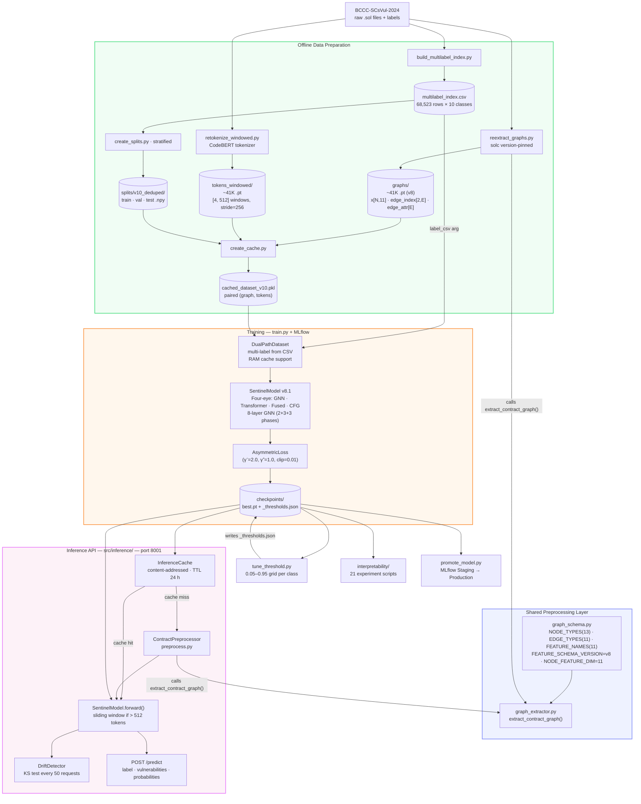
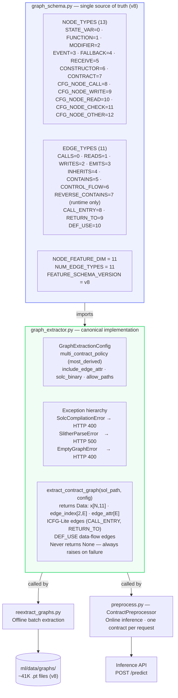
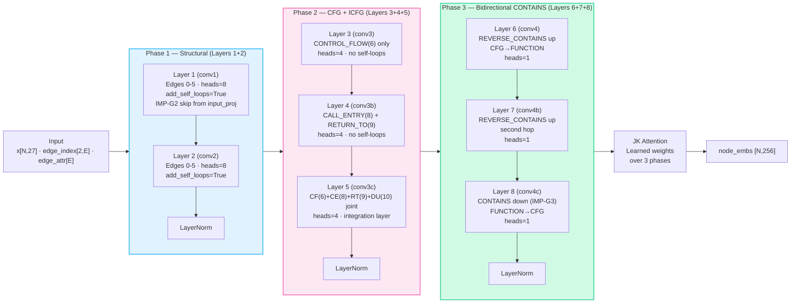
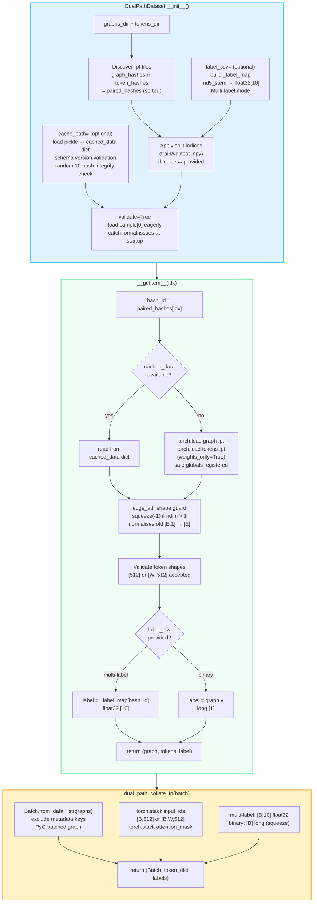
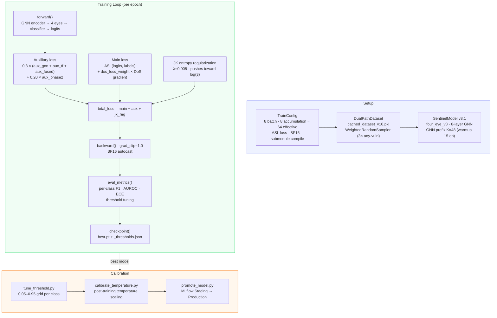
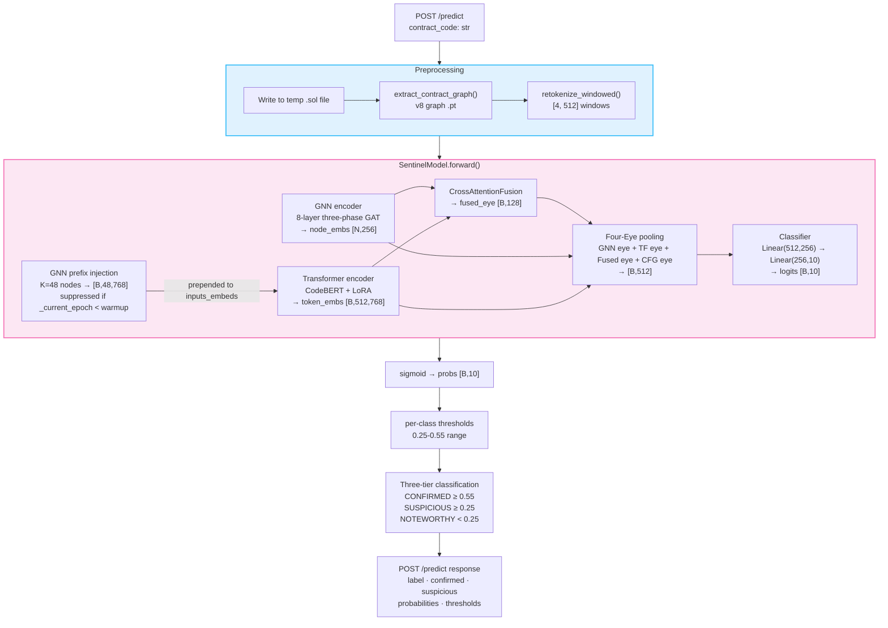

# M1 — ML Core: Visual Diagrams

Interactive Mermaid diagrams for `ml/README.md`. Rendered natively on GitHub.
For tensor-shape step-by-step flows, see the ASCII diagrams in `ml/README.md`.

---

## System Lifecycle

---

## Shared Preprocessing Layer

---

## Model Architecture (v8.1 Four-Eye)

```mermaid
flowchart LR
    SRC(["Solidity\nSource"])

    subgraph GNN["GNN Path — gnn_encoder.py (v8.1)"]
        direction TB
        GE2["graph_extractor.py\nextract_contract_graph()"]
        NF["x  [N, 11]\nnode features (v8)"]
        TE["type_embedding\nEmbedding(13, 16)\n→ [N, 16]"]
        CONCAT["concat\n[N, 27]"]
        EA["edge_emb  Embedding(11,64)\nedge_attr[E] → [E, 64]"]
        SKIP["IMP-G2: input_proj\nLinear(27, 256) skip"]
        P1["Phase 1 (Layers 1+2)\nEdges 0-5 · heads=8\nStructural aggregation"]
        P2["Phase 2 (Layers 3-5)\nEdges 6,8,9,10 · heads=4\nCF + ICFG-Lite + DEF_USE"]
        P3["Phase 3 (Layers 6-8)\nREVERSE_CONTAINS up (layers 6+7)\nCONTAINS down (layer 8, IMP-G3)\nheads=1"]
        JK["JK Attention\nLearned aggregation\nover 3 phase outputs"]
        GE2 --> NF & EA
        NF --> CONCAT
        TE --> CONCAT
        CONCAT --> SKIP
        SKIP --> P1
        EA --> P1
        P1 --> P2 --> P3 --> JK
    end

    subgraph TFM["Transformer Path — transformer_encoder.py"]
        direction TB
        TOK["CodeBERT tokenizer\ninput_ids [B,512] or [B,W,512]\nattn_mask [B,512] or [B,W,512]"]
        CB["CodeBERT  microsoft/codebert-base\n124M params  frozen\nFlash Attention 2"]
        LOR["LoRA  r=16  α=32\n~590K trainable params\nQ+V projections · all 12 layers"]
        TE2["last_hidden_state\n[B, 512, 768] or [B, W*L, 768]\nall token positions"]
        WP["WindowAttentionPooler\nLearned attention over\nW window-CLS tokens → [B, 768]"]
        TOK --> CB
        LOR -. "adapts" .-> CB
        CB --> TE2 --> WP
    end

    subgraph FUS["CrossAttentionFusion — fusion_layer.py"]
        direction TB
        NP["node_proj  Linear(256→256)\n[N,256] → [N,256]"]
        TP["token_proj  Linear(768→256)\n[B,512,768] → [B,512,256]"]
        TN["token_norm  LayerNorm(768)\nBUG-C2 fix"]
        DB["_scatter_to_dense\n[B, 1024, 256] + node_real_mask"]
        N2T["Node→Token MHA\nQ=nodes  K=V=tokens\nmask PAD token positions\n→ enriched_nodes [B,n,256]"]
        T2N["Token→Node MHA\nQ=tokens  K=V=nodes\nmask padded node positions\n→ enriched_tokens [B,512,256]"]
        POL["Masked mean pool\npooled_nodes  [B,256]\npooled_tokens  [B,256]"]
        FOUT["concat → [B,512]\nLinear → ReLU → Dropout\n[B, 128]"]
        NP --> DB --> N2T & T2N
        TP --> TN --> N2T & T2N
        N2T & T2N --> POL --> FOUT
    end

    subgraph EYES["Four-Eye Classifier — sentinel_model.py"]
        direction TB
        GNN_POOL["GNN Eye\nFUNCTION+MODIFIER+FALLBACK+RECEIVE+CONSTRUCTOR\nmax+mean → [B,512] → Linear → [B,128]"]
        TF_POOL["Transformer Eye\nWindow-pooled CLS → [B,768]\nLinear(768,128) → [B,128]"]
        FUSED_EYE["Fused Eye\nCrossAttentionFusion → [B,128]"]
        CFG_EYE["CFG Eye (IMP-R7-2)\nPhase2 pool over CFG nodes [8-12]\nmax+mean → [B,512] → Linear → [B,128]"]
        CONCAT["cat([gnn_eye, tf_eye, fused_eye, cfg_eye])\n[B, 512]"]
        CLS["Classifier\nLinear(512,256) → ReLU → Dropout\nLinear(256,10) → raw logits [B,10]"]
        AUX["Auxiliary Heads (training only)\nLinear(128,10) per eye + aux_phase2\nλ=0.3 main, λ=0.20 phase2"]
        GNN_POOL & TF_POOL & FUSED_EYE & CFG_EYE --> CONCAT --> CLS
        GNN_POOL & TF_POOL & FUSED_EYE & CFG_EYE --> AUX
    end

    PRED["Predictor._score\nsigmoid → probs [B,10]\nper-class thresholds\n→ vulnerabilities list\nlabel: vulnerable / safe"]

    SRC --> GNN & TFM
    JK -->|"node_embs [N,256]\nbatch [N]"| FUS
    WP -->|"[B, 768]"| FUS
    FOUT --> FUSED_EYE
    JK --> GNN_POOL
    JK -->|"raw Phase2\nCFG nodes only"| CFG_EYE
    WP --> TF_POOL
    CLS --> PRED

    style GNN fill:#e0f2fe,stroke:#38bdf8,stroke-width:2px
    style TFM fill:#fce7f3,stroke:#f472b6,stroke-width:2px
    style FUS fill:#fef3c7,stroke:#f59e0b,stroke-width:2px
    style EYES fill:#d1fae5,stroke:#34d399,stroke-width:2px
```

---

## GNN Three-Phase Architecture

---

## DualPathDataset Loading Flow

---

## Training Flow

---

## Inference Pipeline

