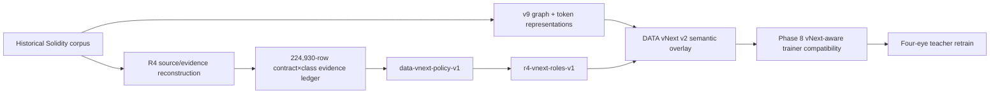
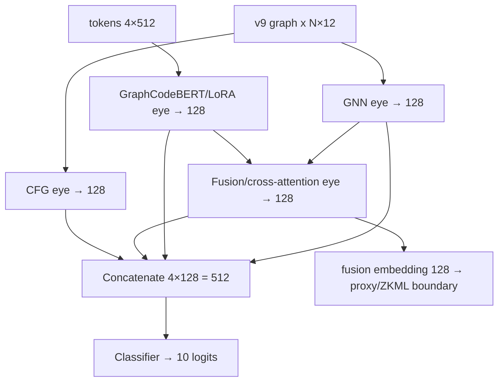
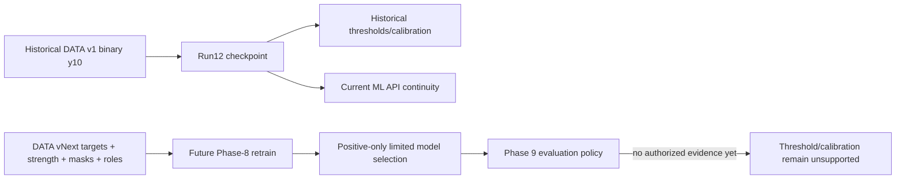
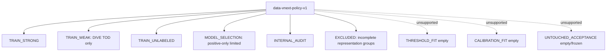
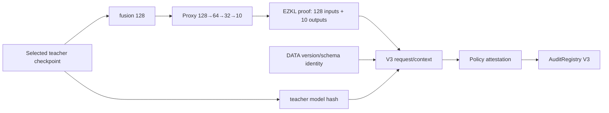
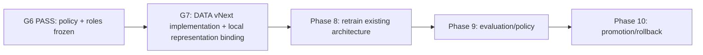

# SENTINEL ML — Current Visual Diagrams

These diagrams show the current **R4-era architecture and lifecycle**. Historical Run12/v1 mechanics still exist in source for reproducibility, but they are not the semantic authority for the repaired retrain.

For exact current status see [`../docs/handbook/16_current_status.md`](../docs/handbook/16_current_status.md).

## 1. DATA → ML boundary

```mermaid
flowchart LR
    SRC[Historical Solidity corpus] --> REP[v9 graph + token representations]
    SRC --> EVD[R4 source/evidence reconstruction]
    EVD --> LED[224,930-row contract×class evidence ledger]
    LED --> POL[data-vnext-policy-v1]
    POL --> ROLE[r4-vnext-roles-v1]
    REP --> V2[DATA vNext v2 semantic overlay]
    ROLE --> V2
    V2 --> P8[Phase 8 vNext-aware trainer compatibility]
    P8 --> TEACH[Four-eye teacher retrain]
```

Key rule: physical representations can stay v9-identical while target semantics change. Historical zero is not negative truth.

## 2. Four-eye teacher

```mermaid
flowchart TD
    G[v9 graph x N×12] --> GNN[GNN eye → 128]
    T[tokens 4×512] --> TR[GraphCodeBERT/LoRA eye → 128]
    G --> CFG[CFG eye → 128]
    GNN --> FUS[Fusion/cross-attention eye → 128]
    TR --> FUS
    GNN --> CAT[Concatenate 4×128 = 512]
    TR --> CAT
    FUS --> CAT
    CFG --> CAT
    CAT --> HEAD[Classifier → 10 logits]
    FUS --> EMB[fusion embedding 128 → proxy/ZKML boundary]
```

The architecture stays frozen for the first repaired retrain. Run12 is the historical operational checkpoint; the repaired model does not exist yet.

## 3. Historical Run12 versus repaired retrain

```mermaid
flowchart LR
    V1[Historical DATA v1 binary y10] --> R12[Run12 checkpoint]
    R12 --> HT[Historical thresholds/calibration]
    R12 --> API[Current ML API continuity]

    V2[DATA vNext targets + strength + masks + roles] --> NEW[Future Phase-8 retrain]
    NEW --> MS[Positive-only limited model selection]
    MS --> P9[Phase 9 evaluation policy]
    P9 -->|no authorized evidence yet| NO[Threshold/calibration remain unsupported]
```

Do not connect `HT` to the future retrained checkpoint automatically.

## 4. Current R4 role authority

```mermaid
flowchart TD
    POL[data-vnext-policy-v1] --> TS[TRAIN_STRONG]
    POL --> TW[TRAIN_WEAK: DIVE TOD only]
    POL --> TU[TRAIN_UNLABELED]
    POL --> MS[MODEL_SELECTION: positive-only limited]
    POL --> IA[INTERNAL_AUDIT]
    POL --> EX[EXCLUDED: incomplete representation groups]

    POL -. unsupported .-> TF[THRESHOLD_FIT empty]
    POL -. unsupported .-> CF[CALIBRATION_FIT empty]
    POL -. unsupported .-> UA[UNTOUCHED_ACCEPTANCE empty/frozen]
```

GasException and UnusedReturn remain output indices but are supervision-disabled in policy v1.

## 5. Teacher → ZKML/V3 lifecycle

```mermaid
flowchart LR
    TEACH[Selected teacher checkpoint] --> F[fusion 128]
    F --> PROXY[Proxy 128→64→32→10]
    PROXY --> EZKL[EZKL proof: 128 inputs + 10 outputs]
    EZKL --> V3[V3 request/context]
    TEACH --> ID[teacher model hash]
    V2[DATA version/schema identity] --> V3
    ID --> V3
    V3 --> SIG[Policy attestation]
    SIG --> REG[AuditRegistry V3]
```

Current retained proxy/proof artifacts belong to historical teacher lineage. Redistill/regenerate only after a repaired teacher candidate is selected.

## 6. Phase sequence

```mermaid
flowchart LR
    G6[G6 PASS: policy + roles frozen] --> G7[G7: DATA vNext implementation + local representation binding]
    G7 --> P8[Phase 8: retrain existing architecture]
    P8 --> P9[Phase 9: evaluation/policy]
    P9 --> P10[Phase 10: promotion/rollback]
```

Current blocker: G7 still needs local physical representation binding on the Phase-7 branch.

## Source map

- architecture: `ml/src/models/`
- current historical inference: `ml/src/inference/`
- historical trainer/loss seam: `ml/src/training/`, `ml/src/datasets/`
- current DATA policy: `docs/plan/ml-R4/specs/data_vnext_policy_v1.json`
- current roles: `docs/plan/ml-R4/manifests/p6_partition_manifest.json`
- canonical explanation: `docs/handbook/04_data_artifacts.md`, `05_ml_model_inference.md`, `06_ml_training_quality.md`, `13_evaluation.md`
