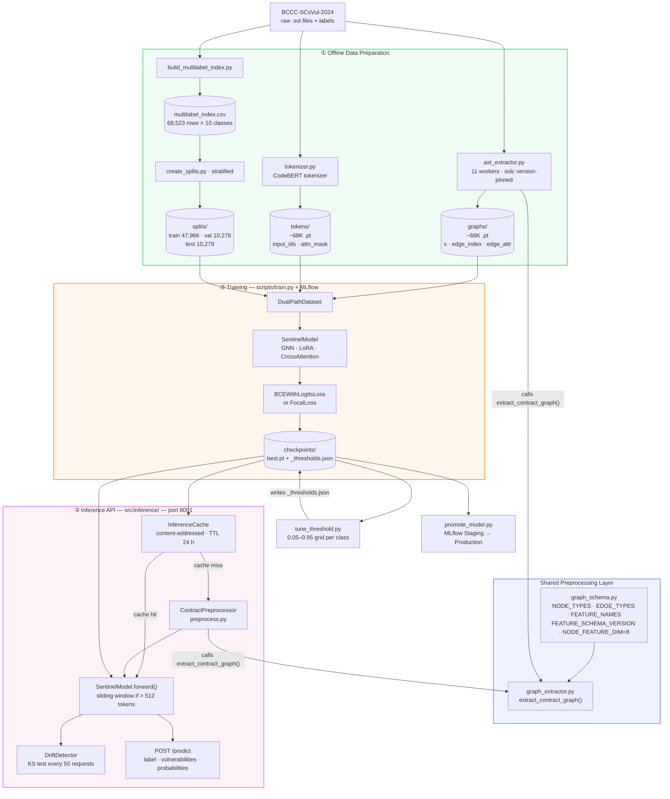
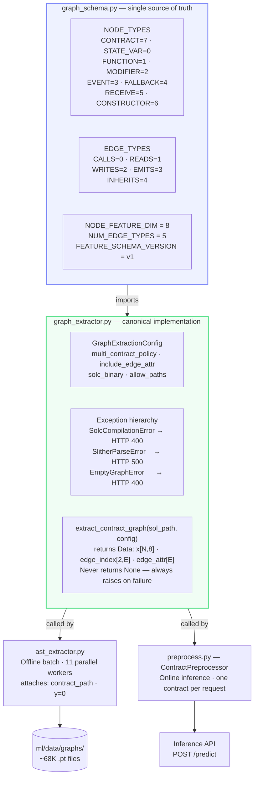

# M1 — ML Core

Dual-path smart contract vulnerability detector. A **Graph Attention Network (GNN)** encodes the contract's AST structure with typed edge relations; a **LoRA-fine-tuned CodeBERT** encodes its source text. A **bidirectional CrossAttentionFusion** merges both representations before a 10-class multi-label sigmoid classifier produces per-vulnerability probabilities.

---

## Table of Contents

- [System Overview](#system-overview)
- [Shared Preprocessing Layer](#shared-preprocessing-layer)
- [Data Preparation](#data-preparation)
  - [Step 1 — Graph Extraction](#step-1--graph-extraction)
  - [Step 2 — Tokenisation](#step-2--tokenisation)
  - [Step 3 — Build Multi-Label Index](#step-3--build-multi-label-index)
  - [Step 4 — Create Stratified Splits](#step-4--create-stratified-splits)
  - [Step 5 — Validate Graph Dataset](#step-5--validate-graph-dataset)
- [Model Architecture](#model-architecture)
  - [GNN Encoder](#gnn-encoder)
  - [Transformer Encoder (CodeBERT + LoRA)](#transformer-encoder-codebert--lora)
  - [CrossAttention Fusion](#crossattention-fusion)
  - [Classifier](#classifier)
  - [Long-Contract Path — Sliding Window](#long-contract-path--sliding-window)
  - [Node Feature Vector](#node-feature-vector)
  - [Edge Types](#edge-types)
- [Output Classes](#output-classes)
- [Dataset](#dataset)
- [Training](#training)
  - [Run Training](#run-training)
  - [Resume from Checkpoint](#resume-from-checkpoint)
  - [Per-Class Threshold Tuning](#per-class-threshold-tuning)
  - [Recommended v4 Configuration](#recommended-v4-configuration)
- [Active Checkpoint](#active-checkpoint)
  - [Per-Class Thresholds and F1 (v3)](#per-class-thresholds-and-f1-v3)
  - [Retrain Evaluation Protocol](#retrain-evaluation-protocol)
- [Inference API](#inference-api)
  - [Endpoints](#endpoints)
  - [HTTP Status Codes](#http-status-codes)
- [Inference Cache](#inference-cache)
- [Drift Detection](#drift-detection)
- [MLflow and Model Registry](#mlflow-and-model-registry)
- [DVC](#dvc)
- [Testing](#testing)
- [File Reference](#file-reference)
- [Critical Constraints](#critical-constraints)
- [Known Limitations](#known-limitations)

---

## System Overview

The diagram below shows the full lifecycle — from raw Solidity contracts to a live inference API.



---

## Shared Preprocessing Layer

**Files:** `ml/src/preprocessing/graph_schema.py` and `ml/src/preprocessing/graph_extractor.py`

These two files form the most architecturally critical layer in the ML module. Before they existed, both the offline batch pipeline (`ast_extractor.py`) and the online inference pipeline (`preprocess.py`) contained identical, hand-duplicated node/edge feature logic. Any change to one required a manual update to the other — a missed sync caused silent inference accuracy regression with no error message (model receives features encoded differently from training).



### What changes require a schema rebuild

Any modification to `NODE_TYPES`, `VISIBILITY_MAP`, `EDGE_TYPES`, or `_build_node_features()` in `graph_extractor.py` requires **all four steps**:

1. Rebuild ~68K graph `.pt` files: `python data_extraction/ast_extractor.py --force`
2. Rebuild token `.pt` files: `python data_extraction/tokenizer.py --force`
3. Retrain the model from scratch: `python scripts/train.py`
4. Increment `FEATURE_SCHEMA_VERSION` in `graph_schema.py` to invalidate the inference cache

Skipping any step causes silent accuracy regression.

---

## Data Preparation

> Only needed when the dataset changes or `FEATURE_SCHEMA_VERSION` is bumped.
> **Never regenerate splits if they already exist** — all experiments share the same held-out val set.

```bash
cd ml
```

### Step 1 — Graph Extraction

Converts raw `.sol` files → PyG `.pt` graph files via Slither.

```
contracts_metadata.parquet
        │
        ▼
ast_extractor.py  ── orchestration only ── (11 parallel workers, solc version-pinned)
        │
        ├── parse_solc_version()     resolve solc binary per version group
        ├── GraphExtractionConfig(   builds config per contract:
        │     solc_binary=...,         version-pinned solc binary
        │     solc_version=...,        for --allow-paths compat check
        │     allow_paths=...,         project root for import resolution
        │     multi_contract_policy="first"
        │   )
        │
        ├── calls ──────────────────────────────────────────────────────────────
        │                                                                       │
        │   graph_extractor.extract_contract_graph(sol_path, config)            │
        │   ┌────────────────────────────────────────────────────────────────┐  │
        │   │  imports from graph_schema.py:                                 │  │
        │   │    NODE_TYPES, EDGE_TYPES, VISIBILITY_MAP, NODE_FEATURE_DIM   │  │
        │   │                                                                │  │
        │   │  Slither(sol_path, solc=..., solc_args=...)                   │  │
        │   │    ↓ raises SolcCompilationError or SlitherParseError on fail  │  │
        │   │  _select_contract()  → first non-dependency contract           │  │
        │   │    ↓ raises EmptyGraphError if all declarations are deps       │  │
        │   │  _build_node_features(obj, type_id) per node                  │  │
        │   │    CONTRACT, STATE_VARs, FUNCTIONs, MODIFIERs, EVENTs         │  │
        │   │    → [type_id, visibility, pure, view, payable,               │  │
        │   │        reentrant, complexity, loc]  8-dim float32             │  │
        │   │  _build_edges()                                               │  │
        │   │    CALLS, READS, WRITES, EMITS, INHERITS                      │  │
        │   │    → edge_index [2, E], edge_attr [E] int64                   │  │
        │   │                                                                │  │
        │   │  returns Data(x, edge_index, edge_attr, contract_name)        │  │
        │   └────────────────────────────────────────────────────────────────┘  │
        │                                                                       │
        ├── ast_extractor attaches caller-specific metadata:                    │
        │     graph.contract_path  → md5-stem path (used to bridge to SHA256)  │
        │     graph.y = 0          (multilabel_index.csv owns labels)           │
        │                                                                       │
        └── writes <md5_of_path>.pt ──► ml/data/graphs/ ──────────────────────┘
              graph.x          [N, 8]   node feature matrix
              graph.edge_index [2, E]   COO connectivity
              graph.edge_attr  [E]      edge type IDs (0–4)
              graph.y          0        (unused in training; CSV owns labels)
              graph.contract_path       Path.stem = SHA256 (bridge to CSV)
```

```bash
# Build with Docker (recommended — no local solc installation needed)
docker build -f docker/Dockerfile.slither -t sentinel-slither .

poetry run python data_extraction/ast_extractor.py \
  --input ml/data/processed/_cache/contracts_metadata.parquet \
  --output ml/data/graphs/
```

> **Two hash systems — never mix:**
> - **SHA256** = hash of `.sol` file *content* → BCCC filename, CSV column 2
> - **MD5** = hash of `.sol` file *path* → `.pt` filename
>
> The bridge: `graph.contract_path` inside each `.pt` → `Path(...).stem` = SHA256.

### Step 2 — Tokenisation

Converts raw `.sol` files → CodeBERT token `.pt` files.

```
contracts_metadata.parquet
        │
        ▼
tokenizer.py  (microsoft/codebert-base tokenizer)
        │
        ├── Reads source code from parquet
        ├── Tokenises with max_length=512, padding + truncation
        └── <md5_of_path>.pt ──► ml/data/tokens/
              tokens.input_ids      [512]  int64
              tokens.attention_mask [512]  int64  (1=real token, 0=PAD)
              tokens.schema_version        FEATURE_SCHEMA_VERSION string
```

```bash
poetry run python data_extraction/tokenizer.py \
  --input ml/data/processed/_cache/contracts_metadata.parquet \
  --output ml/data/tokens/
```

### Step 3 — Build Multi-Label Index

Joins BCCC vulnerability labels into a single CSV indexed by SHA256.

```bash
poetry run python scripts/build_multilabel_index.py
# Output: ml/data/processed/multilabel_index.csv
#         68,523 rows × 10 class columns (0/1 per vulnerability)
```

> `create_label_index.py` is obsolete — `ast_extractor.py` sets `graph.y=0`. Binary labels for stratification are derived from `multilabel_index.csv` by `create_splits.py` (`sum(class_cols) > 0`).

### Step 4 — Create Stratified Splits

Produces fixed train/val/test index arrays from the multi-label index.

```bash
poetry run python scripts/create_splits.py
# Output: ml/data/splits/
#   train_indices.npy   47,966 samples
#   val_indices.npy     10,278 samples
#   test_indices.npy    10,279 samples
# Stratified from multilabel_index.csv (any_vulnerable label)
```

> **Do NOT regenerate** if splits exist. All checkpoints (v1, v2, v3) were evaluated on the same `val_indices.npy`. Regenerating breaks comparability between experiments.

### Step 5 — Validate Graph Dataset

Before any training run, confirm all `.pt` graph files are compatible.

```bash
poetry run python scripts/validate_graph_dataset.py [--graphs-dir ml/data/graphs]
# Checks:
#   • edge_attr present in every file
#   • shape is [E] — 1-D int64 (NOT the old [E, 1] shape)
#   • all values in [0, NUM_EDGE_TYPES) = [0, 5)
#
# Exit 0 → safe to train
# Exit 1 → re-extract with ast_extractor.py --force first
```

---

## Model Architecture

```mermaid
flowchart LR
    SRC(["Solidity\nSource"])

    subgraph GNN["GNN Path — gnn_encoder.py"]
        direction TB
        GE2["graph_extractor.py\nextract_contract_graph()"]
        NF["x  [N, 8]\nnode features"]
        EA["edge_emb  Embedding(5,16)\nedge_attr[E] → [E, 16]"]
        C1["GATConv conv1\nin=8 → heads=8 → [N,64]\nReLU + Dropout"]
        C2["GATConv conv2\nin=64 → heads=8 → [N,64]\nReLU + Dropout"]
        C3["GATConv conv3\nin=64 → heads=1 → [N,64]"]
        GE2 --> NF & EA
        NF & EA --> C1 --> C2 --> C3
    end

    subgraph TFM["Transformer Path — transformer_encoder.py"]
        direction TB
        TOK["CodeBERT tokenizer\ninput_ids [B,512]\nattn_mask [B,512]"]
        CB["CodeBERT  microsoft/codebert-base\n124M params  frozen"]
        LOR["LoRA  r=8  α=16\n~295K trainable params\nQ+V projections · all 12 layers"]
        TE["last_hidden_state\n[B, 512, 768]\nall token positions"]
        TOK --> CB
        LOR -. "adapts" .-> CB
        CB --> TE
    end

    subgraph FUS["CrossAttentionFusion — fusion_layer.py"]
        direction TB
        NP["node_proj  Linear(64→256)\n[N,64] → [N,256]"]
        TP["token_proj  Linear(768→256)\n[B,512,768] → [B,512,256]"]
        DB["to_dense_batch\n[B, max_n, 256] + node_real_mask"]
        N2T["Node→Token MHA\nQ=nodes  K=V=tokens\nmask PAD token positions\n→ enriched_nodes [B,n,256]"]
        T2N["Token→Node MHA\nQ=tokens  K=V=nodes\nmask padded node positions\n→ enriched_tokens [B,512,256]"]
        POL["Masked mean pool\npooled_nodes  [B,256]\npooled_tokens [B,256]"]
        FOUT["concat → [B,512]\nLinear → ReLU → Dropout\n[B, 128]  ← LOCKED"]
        NP --> DB --> N2T & T2N
        TP --> N2T & T2N
        N2T & T2N --> POL --> FOUT
    end

    CLS["Classifier\nLinear(128, 10)\nraw logits [B, 10]\nno Sigmoid inside model"]
    PRED["Predictor._score\nsigmoid → probs [B,10]\nper-class thresholds\n→ vulnerabilities list\nlabel: vulnerable / safe"]

    SRC --> GNN & TFM
    C3 -->|"node_embs [N,64]\nbatch [N]"| FUS
    TE -->|"[B, 512, 768]"| FUS
    FOUT --> CLS --> PRED

    style GNN fill:#e0f2fe,stroke:#38bdf8,stroke-width:2px
    style TFM fill:#fce7f3,stroke:#f472b6,stroke-width:2px
    style FUS fill:#fef3c7,stroke:#f59e0b,stroke-width:2px
```



### GNN Encoder

**File:** `ml/src/models/gnn_encoder.py`

```
Input: x [N, 8],  edge_index [2, E],  batch [N],  edge_attr [E]
           │                                              │
           │                  edge_emb                   │
           │          Embedding(5, 16) [E] → [E, 16]    │
           │                    │                        │
           ▼                    ▼                        │
      GATConv conv1  (in=8,  out=8,  heads=8, edge_dim=16)
           → [N, 64]   (8 heads × 8 dims, concat=True)
           → ReLU → Dropout(0.2)

      GATConv conv2  (in=64, out=8,  heads=8, edge_dim=16)
           → [N, 64]   2-hop context
           → ReLU → Dropout(0.2)

      GATConv conv3  (in=64, out=64, heads=1, edge_dim=16)
           → [N, 64]   3-hop context, final node embeddings
           (no activation — CrossAttentionFusion projects next)

Output: node_embs [N, 64],  batch [N]
        (NOT pooled — pooling deferred to CrossAttentionFusion)
```

> **Why edge_attr matters:** A `CALLS` edge versus a `READS` edge are fundamentally different structural patterns. Reentrancy requires a `CALLS` edge back to the caller. Without typed edges, GATConv attention is purely node-feature-based and cannot distinguish "this node calls something" from "this node reads something".
>
> **Graceful degradation:** If `edge_attr=None` (legacy `.pt` files), edge embeddings fall back to zero vectors so old checkpoints still run.

### Transformer Encoder (CodeBERT + LoRA)

**File:** `ml/src/models/transformer_encoder.py`

```
Input: input_ids [B, 512],  attention_mask [B, 512]
           │
           ▼
  CodeBERT (microsoft/codebert-base)
  ├── 12 attention layers, hidden_dim=768
  ├── 124,705,536 parameters — ALL FROZEN (requires_grad=False)
  └── LoRA matrices injected into query + value of every layer
        A [768, r=8]  and  B [r=8, 768]  per projection
        Forward: W_frozen @ x + (B @ A) @ x × (alpha/r=2.0)
        Trainable: ~295,296 parameters across 12 layers × Q+V

Output: last_hidden_state [B, 512, 768]
        ALL 512 token positions (not just CLS)
        → CrossAttentionFusion uses every position for node→token attention
```

> **Why LoRA, not full fine-tune:** 125M full-fine-tune → OOM on 8 GB VRAM + catastrophic forgetting on 68K contracts. Frozen: 0 trainable → never adapts to vulnerability semantics. LoRA injects only ~295K trainable parameters — enough to steer attention toward security-relevant patterns without touching the frozen backbone.

### CrossAttention Fusion

**File:** `ml/src/models/fusion_layer.py`

```
node_embs [N, 64]   +   token_embs [B, 512, 768]   +   attention_mask [B, 512]
      │                         │
      ▼                         ▼
node_proj Linear(64→256)   token_proj Linear(768→256)
      │                         │
      ▼                         │
to_dense_batch()                │
  padded_nodes [B, n, 256]      │
  node_real_mask [B, n]         │
  node_padding_mask = ~mask     │
                                │
      ┌─────────────────────────┘
      │         token_padding_mask = (attention_mask == 0)
      │
      ├── Node→Token MHA   Q=nodes,  K=V=tokens,  key_mask=token PAD
      │         → enriched_nodes [B, n, 256]
      │         (zero-out padding node positions after attention)
      │
      └── Token→Node MHA   Q=tokens, K=V=nodes,   key_mask=node padding
                → enriched_tokens [B, 512, 256]

Masked mean pool enriched_nodes  → pooled_nodes  [B, 256]
Masked mean pool enriched_tokens → pooled_tokens [B, 256]

cat([pooled_nodes, pooled_tokens]) → [B, 512]
Linear(512→128) → ReLU → Dropout → [B, 128]  ← LOCKED (ZKML depends on this)
```

### Classifier

```
[B, 128]  →  nn.Linear(128, 10)  →  raw logits [B, 10]

No Sigmoid inside the model.
  Training:  BCEWithLogitsLoss / FocalLoss apply Sigmoid internally.
  Inference: Predictor._score() applies sigmoid(logits) externally.
```

### Long-Contract Path — Sliding Window

Contracts exceeding 512 CodeBERT tokens are automatically split into overlapping windows.

```
Source > 512 tokens?
        │
        ▼ YES
Sliding window tokenisation
  window_size = 512 tokens
  stride      = 256 tokens
  max_windows = 8

GNN graph built ONCE from the full AST (no windowing on graph side)

Per window:
  SentinelModel.forward(graph, window_input_ids, window_mask) → probs [1, 10]

Aggregate across windows:
  final_probs[class] = max(window_probs[class])   per class

API response includes: "windows_used": N
```

### Node Feature Vector

8-dimensional, fixed order — changing any index requires a full dataset rebuild + retrain.

| Index | Feature | Encoding |
|-------|---------|----------|
| 0 | `type_id` | CONTRACT=7, STATE_VAR=0, FUNCTION=1, MODIFIER=2, EVENT=3, FALLBACK=4, RECEIVE=5, CONSTRUCTOR=6 |
| 1 | `visibility` | public/external=0, internal=1, private=2 |
| 2 | `pure` | 0/1 |
| 3 | `view` | 0/1 |
| 4 | `payable` | 0/1 |
| 5 | `reentrant` | 0/1 (Slither `is_reentrant` flag) |
| 6 | `complexity` | float — CFG node count |
| 7 | `loc` | float — lines of source |

Node insertion order: `CONTRACT → STATE_VARs → FUNCTIONs → MODIFIERs → EVENTs`

Non-function nodes (state variables, events, modifiers, contract) receive `0.0` for features 2–5.

### Edge Types

Stored in `graph.edge_attr [E]` as 1-D int64 tensor.

| ID | Type | Meaning |
|----|------|---------|
| 0 | `CALLS` | function → internally-called function |
| 1 | `READS` | function → state variable it reads |
| 2 | `WRITES` | function → state variable it writes |
| 3 | `EMITS` | function → event it emits |
| 4 | `INHERITS` | contract → parent contract (linearised MRO) |

---

## Output Classes

Defined in `ml/src/training/trainer.py` as `CLASS_NAMES` — the **single source of truth** for index order. Never insert in the middle; append new classes at index 10+.

| Index | Class |
|-------|-------|
| 0 | CallToUnknown |
| 1 | DenialOfService |
| 2 | ExternalBug |
| 3 | GasException |
| 4 | IntegerUO |
| 5 | MishandledException |
| 6 | Reentrancy |
| 7 | Timestamp |
| 8 | TransactionOrderDependence |
| 9 | UnusedReturn |

---

## Dataset

| Item | Value |
|------|-------|
| Source | BCCC-SCsVul-2024 |
| Graph `.pt` files | 68,523 (MD5 stem, `ml/data/graphs/`) — re-extracted 2026-05-03 for `edge_attr [E]` shape |
| Token `.pt` files | 68,568 (MD5 stem, `ml/data/tokens/`) |
| Split — train | 47,966 samples |
| Split — val | 10,278 samples |
| Split — test | 10,279 samples |
| Vulnerable rate | 64.3% (stratified from `multilabel_index.csv`) |
| Label CSV | `ml/data/processed/multilabel_index.csv` — 68,523 rows × 10 classes |

---

## Training

### Run Training

```bash
cd ml
TRANSFORMERS_OFFLINE=1 poetry run python scripts/train.py \
  --run-name   multilabel-v3-fresh-60ep \
  --experiment sentinel-retrain-v3 \
  --label-csv  data/processed/multilabel_index.csv \
  --epochs     60 \
  --batch-size 32 \
  --patience   10
```

Key `TrainConfig` fields:

| Field | v3 value | Notes |
|-------|----------|-------|
| `architecture` | `"cross_attention_lora"` | Written into checkpoint config |
| `batch_size` | 32 | Safe on RTX 3070 8 GB with AMP |
| `lora_r` | 8 | LoRA rank (~295K trainable params) |
| `lora_alpha` | 16 | Effective scale = alpha/r = 2.0 |
| `loss_fn` | `"bce"` | v4 plan: switch to `"focal"` |
| `use_edge_attr` | True | Typed edge-relation embeddings |
| `gnn_edge_emb_dim` | 16 | Edge embedding dimension |
| `fusion_output_dim` | 128 | Fused representation size (**LOCKED**) |
| `grad_clip` | 1.0 | Prevents LoRA gradient spikes |
| `patience` | 10 | Early-stop on val F1-macro |

Speed optimisations active: AMP/BF16, TF32 matmuls, persistent DataLoader workers, `zero_grad(set_to_none=True)`.

MLflow tracks per run: all `TrainConfig` fields, `val_f1_macro`, `val_f1_micro`, `val_hamming`, `val_exact_match`, `focal_gamma`, `focal_alpha`, and `val_f1_{class}` × 10.

### Resume from Checkpoint

```bash
poetry run python scripts/train.py \
  --resume-from ml/checkpoints/multilabel-v3-fresh-60ep_best.pt

# --no-resume-model-only    full resume: model + optimizer + scheduler + patience counter
# --resume-reset-optimizer  keep model weights, reset optimizer state only
```

Validates on resume: `num_classes` and `architecture` must match current `TrainConfig`.

Load pattern (required — `weights_only=True` breaks LoRA state dict):

```python
raw = torch.load(path, weights_only=False)
state_dict = raw["model"] if "model" in raw else raw
```

### Per-Class Threshold Tuning

Run after **every** training completion. Sweeps thresholds 0.05–0.95 per class on the held-out validation split.

```bash
TRANSFORMERS_OFFLINE=1 ml/.venv/bin/python scripts/tune_threshold.py \
  --checkpoint ml/checkpoints/multilabel-v3-fresh-60ep_best.pt
# Writes: ml/checkpoints/multilabel-v3-fresh-60ep_best_thresholds.json
```

The thresholds JSON **must travel with** its checkpoint. Never deploy a checkpoint without its companion JSON.

### Recommended v4 Configuration

v3 plateaued at raw F1-macro 0.4715 from epoch ~54, signalling a capacity ceiling under BCE loss with LoRA r=8.

```bash
TRANSFORMERS_OFFLINE=1 poetry run python scripts/train.py \
  --run-name    multilabel-v4-focal-lora16 \
  --experiment  sentinel-retrain-v4 \
  --epochs      60 \
  --batch-size  32 \
  --patience    10 \
  --loss-fn     focal \
  --focal-gamma 2.0 \
  --lora-r      16 \
  --lora-alpha  32
```

| Change | Rationale |
|--------|-----------|
| `--loss-fn focal --focal-gamma 2.0` | Down-weights easy negatives; forces attention on DenialOfService (137 support) and CallToUnknown |
| `--lora-r 16` | Doubles trainable params (~589K vs 295K), addressing the plateau |
| Weighted sampler for DenialOfService | 39× underrepresented vs IntegerUO |

---

## Active Checkpoint

```
── v3 (current best) ────────────────────────────────────────────────────────────
File:        ml/checkpoints/multilabel-v3-fresh-60ep_best.pt
Thresholds:  ml/checkpoints/multilabel-v3-fresh-60ep_best_thresholds.json
Run:         multilabel-v3-fresh-60ep  (sentinel-retrain-v3)
Completed:   2026-05-05  |  60 epochs  |  batch_size=32
Best epoch:  ~52–53
Raw F1-macro:    0.4715
Tuned F1-macro:  0.5069  ✅ (gate was > 0.4884)
Architecture:    cross_attention_lora  (LoRA r=8 α=16, edge_attr active)

── v2 (paused — superseded) ──────────────────────────────────────────────────────
File:        ml/checkpoints/multilabel_crossattn_v2_best.pt
Status:      Stopped at epoch 43, batch-size mismatch. Superseded by v3.
Best raw F1: 0.4629 (epoch 37)

── baseline (pre-edge_attr) ──────────────────────────────────────────────────────
File:        ml/checkpoints/multilabel_crossattn_best.pt
Val F1-macro: 0.4679  (epoch 34)
Architecture: cross_attention_lora  (trained WITHOUT edge_attr, pre-P0-B)
```

### Per-Class Thresholds and F1 (v3)

| Class | Threshold | F1 | Precision | Recall | Support |
|-------|-----------|----|-----------|--------|---------|
| CallToUnknown | 0.70 | 0.394 | 0.322 | 0.507 | 1,266 |
| DenialOfService | 0.95 | 0.400 | 0.318 | 0.540 | 137 |
| ExternalBug | 0.65 | 0.435 | 0.312 | 0.715 | 1,622 |
| GasException | 0.55 | 0.550 | 0.403 | 0.867 | 2,589 |
| IntegerUO | 0.50 | 0.821 | 0.759 | 0.896 | 5,343 |
| MishandledException | 0.60 | 0.492 | 0.365 | 0.754 | 2,207 |
| Reentrancy | 0.65 | 0.536 | 0.449 | 0.665 | 2,501 |
| Timestamp | 0.75 | 0.479 | 0.403 | 0.591 | 1,077 |
| TransactionOrderDependence | 0.60 | 0.477 | 0.342 | 0.787 | 1,800 |
| UnusedReturn | 0.70 | 0.486 | 0.395 | 0.631 | 1,716 |

### Retrain Evaluation Protocol

| Gate | Requirement |
|------|-------------|
| Graph dataset | `validate_graph_dataset.py` exits 0 |
| Held-out split | Use `ml/data/splits/val_indices.npy` — do NOT regenerate |
| **v4 success gate** | Tuned val F1-macro > **0.5069** on the same held-out split |
| Per-class floor | No class drops > 0.05 F1 from v3 tuned values |
| Rollback rule | Tuned F1 < 0.5069 → revert to v3 checkpoint, adjust hyperparameters |
| MLflow experiment | `sentinel-retrain-v4` |

---

## Inference API

Start the server:

```bash
TRANSFORMERS_OFFLINE=1 \
SENTINEL_CHECKPOINT=ml/checkpoints/multilabel-v3-fresh-60ep_best.pt \
SENTINEL_THRESHOLDS=ml/checkpoints/multilabel-v3-fresh-60ep_best_thresholds.json \
ml/.venv/bin/uvicorn ml.src.inference.api:app --port 8001
```

Environment variables:

| Variable | Default | Purpose |
|----------|---------|---------|
| `SENTINEL_CHECKPOINT` | `ml/checkpoints/multilabel-v3-fresh-60ep_best.pt` | Checkpoint path |
| `SENTINEL_THRESHOLDS` | auto-detected (`{checkpoint_stem}_thresholds.json`) | Per-class threshold JSON |
| `SENTINEL_PREDICT_TIMEOUT` | `60` | Inference timeout (seconds) |
| `SENTINEL_DRIFT_BASELINE` | `ml/data/drift_baseline.json` | Drift detection baseline |
| `SENTINEL_DRIFT_CHECK_INTERVAL` | `50` | KS test every N requests |

### Endpoints

**`POST /predict`**

```json
// Request
{ "source_code": "<solidity source string>" }

// Response
{
  "label": "vulnerable",
  "vulnerabilities": [
    { "vulnerability_class": "Reentrancy", "probability": 0.8943 },
    { "vulnerability_class": "IntegerUO",  "probability": 0.7102 }
  ],
  "thresholds": [0.70, 0.95, 0.65, 0.55, 0.50, 0.60, 0.65, 0.75, 0.60, 0.70],
  "truncated": false,
  "windows_used": 1,
  "num_nodes": 12,
  "num_edges": 18
}
```

- `thresholds` — 10 per-class values in `CLASS_NAMES` index order
- `truncated: true` — single window was cut at 512 tokens
- `windows_used > 1` — sliding-window path was taken

**`GET /health`**

```json
{
  "status": "ok",
  "predictor_loaded": true,
  "checkpoint": "ml/checkpoints/multilabel-v3-fresh-60ep_best.pt",
  "architecture": "cross_attention_lora",
  "thresholds_loaded": true
}
```

**`GET /metrics`**

Prometheus endpoint (via `prometheus-fastapi-instrumentator`).

| Metric | Type | Description |
|--------|------|-------------|
| `sentinel_model_loaded` | Gauge | 1 when predictor is loaded, 0 on shutdown |
| `sentinel_gpu_memory_bytes` | Gauge | GPU memory allocated (bytes), updated per request |
| `sentinel_drift_alerts_total{stat}` | Counter | KS drift alerts, labelled by stat name |

### HTTP Status Codes

| Code | Meaning |
|------|---------|
| 200 | Success |
| 400 | Invalid or empty Solidity input |
| 413 | Source too large (> 1 MB) or GPU OOM |
| 503 | Predictor not yet loaded |
| 504 | Inference timeout |

---

## Inference Cache

**File:** `ml/src/inference/cache.py`

`InferenceCache` is a disk-backed, content-addressed cache that eliminates the 3–5 s Slither cost on repeated contracts.

```
Cache key: "{content_md5}_{FEATURE_SCHEMA_VERSION}"
                │                    │
                │                    └── bumping version auto-invalidates
                │                        all stale entries
                └── content hash (not path hash — same contract
                    uploaded twice reuses the cache entry)

Cache hit  → return (graph.pt, tokens.pt) directly, skip Slither
Cache miss → run ContractPreprocessor, write result to disk
TTL        → configurable, default 86400 s (24 hours)
```

```python
from ml.src.inference.cache import InferenceCache
from ml.src.inference.preprocess import ContractPreprocessor

cache = InferenceCache(cache_dir="~/.cache/sentinel/preprocess", ttl_seconds=86400)
preprocessor = ContractPreprocessor(cache=cache)
```

---

## Drift Detection

**File:** `ml/src/inference/drift_detector.py`

`DriftDetector` runs a Kolmogorov-Smirnov test per feature statistic against a pre-built baseline. It fires the `sentinel_drift_alerts_total` Prometheus counter when p < 0.05.

```
Request stream
      │
      ▼
DriftDetector.update(graph_stats)
      │
      ├── requests < 500?  → warm-up mode: suppress all KS alerts
      │
      └── requests ≥ 500?  → KS test per feature stat every N requests
                                p < 0.05 → increment sentinel_drift_alerts_total{stat}
```

**Build the baseline after warm-up (not from training data):**

```bash
# After collecting ≥ 500 real audit requests:
python ml/scripts/compute_drift_baseline.py \
    --source      warmup \
    --warmup-log  ml/data/warmup_stats.jsonl \
    --output      ml/data/drift_baseline.json
```

> **Important:** Do not build the baseline from BCCC-2024 training data. That corpus will produce false alerts on modern 2026 contracts. The baseline must come from real production traffic.

---

## MLflow and Model Registry

```bash
mlflow ui --port 5000
# → http://localhost:5000
```

Experiment history:

| Experiment | Status | Best Tuned F1 |
|------------|--------|---------------|
| `sentinel-multilabel` | complete | 0.4679 (epoch 34) |
| `sentinel-retrain-v2` | paused at epoch 43 (batch-size mismatch) | 0.4629 |
| `sentinel-retrain-v3` | complete | **0.5069** |

**Promote a checkpoint to the registry:**

```bash
python ml/scripts/promote_model.py \
    --checkpoint   ml/checkpoints/multilabel-v3-fresh-60ep_best.pt \
    --stage        Staging \
    --val-f1-macro 0.5069 \
    --note         "v3: edge_attr active; tuned F1-macro 0.5069"

# --dry-run           preview without writing to MLflow
# --stage Production  archives the previous Production version
```

---

## DVC

Large artifacts (graphs, tokens, splits, checkpoints) are DVC-tracked, not stored in git.

```bash
dvc pull   # download current data version
dvc push   # push new artifacts after retraining
```

Tracked files:

| DVC pointer | Content |
|-------------|---------|
| `ml/data/graphs.dvc` | ~68K graph `.pt` files |
| `ml/data/tokens.dvc` | ~68K token `.pt` files |
| `ml/data/splits.dvc` | `train/val/test_indices.npy` |
| `ml/checkpoints.dvc` | All checkpoint `.pt` + threshold `.json` files |

---

## Testing

```bash
cd ml
poetry run pytest tests/ -v
```

10 test modules — all use synthetic data (no real contracts or checkpoints required).

| Test file | What it covers |
|-----------|----------------|
| `test_model.py` | `SentinelModel` forward pass, output shape, class count |
| `test_gnn_encoder.py` | `GNNEncoder`: edge_attr embedding, graceful degradation on None, head divisibility |
| `test_fusion_layer.py` | `CrossAttentionFusion`: output shape, masked pooling, device parity |
| `test_preprocessing.py` | `ContractPreprocessor`, `graph_extractor` typed exceptions |
| `test_dataset.py` | `DualPathDataset`: pairing logic, split loading, collation |
| `test_trainer.py` | `FocalLoss` forward, trainer utilities |
| `test_api.py` | `/predict` and `/health` endpoint contracts, error codes |
| `test_cache.py` | `InferenceCache`: miss writes, hit returns same object, TTL expiry, schema version invalidation |
| `test_drift_detector.py` | `DriftDetector`: warm-up suppression, KS fires on p < 0.05, buffer rolling |
| `test_promote_model.py` | `promote_model.py`: stage validation, dry-run no-op, MLflow tag writes |

---

## File Reference

```
ml/
├── src/
│   ├── models/
│   │   ├── sentinel_model.py        SentinelModel — top-level orchestrator
│   │   ├── gnn_encoder.py           GNNEncoder — 3-layer GAT + edge-type embeddings → [N, 64]
│   │   ├── transformer_encoder.py   TransformerEncoder — CodeBERT + LoRA (r=8 default)
│   │   └── fusion_layer.py          CrossAttentionFusion — output_dim=128 (LOCKED)
│   │
│   ├── preprocessing/
│   │   ├── graph_schema.py          NODE_TYPES, EDGE_TYPES, FEATURE_NAMES,
│   │   │                            FEATURE_SCHEMA_VERSION, NODE_FEATURE_DIM, NUM_EDGE_TYPES
│   │   └── graph_extractor.py       extract_contract_graph() — Slither → PyG Data; typed exceptions
│   │
│   ├── inference/
│   │   ├── api.py                   FastAPI app — lifespan, /predict, /health, /metrics
│   │   ├── predictor.py             Predictor — checkpoint loading, sigmoid, per-class thresholds
│   │   ├── preprocess.py            ContractPreprocessor — Slither + tokenisation + sliding window + cache
│   │   ├── cache.py                 InferenceCache — disk-backed content-addressed cache
│   │   └── drift_detector.py        DriftDetector — KS-based feature drift monitoring
│   │
│   ├── training/
│   │   ├── trainer.py               Trainer, TrainConfig, CLASS_NAMES, NUM_CLASSES
│   │   └── focalloss.py             FocalLoss — gamma=2.0 default, FP32 cast; opt-in via loss_fn="focal"
│   │
│   ├── datasets/
│   │   └── dual_path_dataset.py     DualPathDataset, dual_path_collate_fn
│   │
│   └── utils/
│       └── hash_utils.py            get_contract_hash(), get_contract_hash_from_content()
│
├── data_extraction/
│   ├── ast_extractor.py             Offline batch Slither → PyG .pt conversion (V4.3)
│   └── tokenizer.py                 Offline CodeBERT tokenisation with schema version metadata
│
├── scripts/
│   ├── train.py                     Main training entry point (full-resume, reset-optimizer flags)
│   ├── tune_threshold.py            Per-class threshold sweep (0.05–0.95 grid)
│   ├── create_splits.py             Fixed stratified train/val/test split indices
│   ├── build_multilabel_index.py    Build multilabel_index.csv from BCCC labels
│   ├── validate_graph_dataset.py    Validate edge_attr presence + shape [E] + value range
│   ├── analyse_truncation.py        Measure token truncation stats across dataset
│   ├── promote_model.py             MLflow model registry CLI — Staging / Production promotion
│   └── compute_drift_baseline.py    Build drift_baseline.json from warmup logs
│
├── docker/
│   └── Dockerfile.slither           Docker image with Slither + multi-version solc
│
├── tests/                           10 test modules — all synthetic data
│
├── data/                            DVC-tracked (not in git)
│   ├── graphs/                      ~68K <md5>.pt PyG graph files
│   ├── tokens/                      ~68K <md5>.pt token tensor files
│   ├── splits/                      train/val/test_indices.npy
│   └── processed/
│       └── multilabel_index.csv     68,523 rows × 10 class columns
│
└── checkpoints/                     DVC-tracked (not in git)
    ├── multilabel-v3-fresh-60ep_best.pt            ← active (v3, tuned F1 0.5069)
    ├── multilabel-v3-fresh-60ep_best_thresholds.json
    ├── multilabel_crossattn_v2_best.pt             ← paused v2 (superseded)
    ├── multilabel_crossattn_best.pt                ← original baseline (pre-edge_attr)
    └── multilabel_crossattn_best_thresholds.json
```

---

## Critical Constraints

| Constraint | Locked Value | Consequence of change |
|-----------|-------------|----------------------|
| `GNNEncoder in_channels` | **8** | Rebuild all 68K graph files + retrain |
| CodeBERT model | `microsoft/codebert-base` | Rebuild token files + retrain |
| `MAX_TOKEN_LENGTH` | **512** | Rebuild token files + retrain |
| Node feature order | fixed 8-dim (see table above) | Rebuild graph files + retrain |
| `CrossAttentionFusion output_dim` | **128** | Rebuild ZKML circuit + redeploy verifier |
| `FEATURE_SCHEMA_VERSION` | **`"v1"`** | Bump only alongside graph rebuild — invalidates inference cache |
| `CLASS_NAMES` order | indices **0–9 stable** | Silent wrong-class mapping across all consumers |
| `NUM_EDGE_TYPES` | **5** | Rebuild edge_emb layer + retrain |
| `weights_only=False` on checkpoint load | required | LoRA state dict contains peft-specific objects |
| `TRANSFORMERS_OFFLINE` | must be set at **shell level** | Cannot be set inside Python after `transformers` is imported |
| `edge_attr` shape | **`[E]` (1-D int64)** | `[E, 1]` crashes `nn.Embedding`; validate with `validate_graph_dataset.py` |

---

## Known Limitations

**1. Multi-contract files**
Only the first non-dependency contract per `.sol` file is analysed. `GraphExtractionConfig.multi_contract_policy` scaffold exists (`"first"`, `"by_name"`); the `"all"` policy is not yet implemented. See ROADMAP Move 9.

**2. DenialOfService class**
137 training samples — 39× fewer than IntegerUO. Even with threshold tuning to 0.95, F1 is 0.40. Weighted sampling and focal loss are the planned remediation for v4.

**3. Drift baseline not yet collected**
`DriftDetector` is code-complete but cannot be activated in production until the warm-up phase (first 500 real audit requests) has been run to generate `drift_baseline.json`. Use `compute_drift_baseline.py --source warmup` after warm-up completes.
